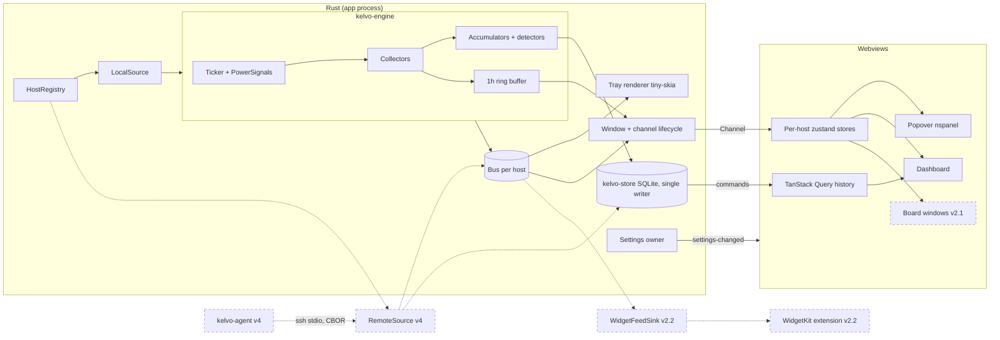

# Kelvo plan

This folder is the plan for Kelvo, from the first installable build through remote host monitoring. Start here, then read the doc for the version you are working on. Nothing in this folder is implemented yet; the repo is still the `create-tauri-app` scaffold.

| Doc | What it covers |
|---|---|
| [architecture.md](architecture.md) | Cross-version system design: crates, data model, engine, store, protocol, app shell, frontend, performance budget |
| [design-system.md](design-system.md) | How opendata's design language is adapted, tokens, components, motion, chart rules, mock-to-route index |
| [v1-local-monitor.md](v1-local-monitor.md) | v1.x: tray, popover, dashboard, Timeline, history |
| [v2-customization-widgets.md](v2-customization-widgets.md) | v2.x: widget manifest, composer, floating desktop widgets, WidgetKit dev build |
| [v3-native-distribution.md](v3-native-distribution.md) | v3.x: Developer ID, notarization, public WidgetKit, App Store evaluation |
| [v4-remote-hosts.md](v4-remote-hosts.md) | v4.x: `kelvo-agent`, SSH transport, sync, fleet view |
| [decisions.md](decisions.md) | ADR log: every decision with its reasoning and when to revisit it |
| [PROGRESS.md](PROGRESS.md) | Implementation progress tracker |

## 1. What Kelvo is

Kelvo is an open-source macOS system monitor for Apple Silicon. It lives in the menu bar, opens a popover with live CPU, GPU, memory, power, network and battery cards, and has a dashboard window with per-module pages and a Timeline that keeps 30 days of history. The thing that sets it apart is that it remembers: when the fans spun up at 3pm, Kelvo can show what the machine was doing and which processes were responsible. It is built on Tauri 2 with a Rust engine and a React 19 and Tailwind v4 frontend, and it is meant to cost less CPU than the tools it replaces. It supports the current macOS release and the one before it (macOS 27 and 26 today, D-028).

## 2. Problem and first users

People on Apple Silicon cannot easily answer "what made my fans spin up at 3pm?" today. Stats covers a lot of modules but keeps no history, costs noticeable CPU itself (GitHub issues #2351, #606, #2901), and mislabels sensors on M3, M4 and M5 chips. iStat Menus 7's redesign alienated a share of its users. macmon and asitop have the best Apple Silicon data (per-cluster residency, component power) but are command-line only and keep no history.

The first users are Apple Silicon developers who already run macmon or asitop. They care about the numbers being right, they notice when a monitor costs CPU, and they are the people most likely to file a sensor dump when their chip is not recognised.

## 3. Jobs to be done

Glance: "Tell me in one second whether my machine is under load, hot, or fine." The tray icon and the popover serve this.

Look back and attribute: "Something happened earlier. Show me what, and which process did it." The Timeline, the process snapshots and the auto-annotations serve this.

Ambient display: "Keep a few numbers on my desktop while I work, without opening anything." Floating desktop widgets and WidgetKit widgets serve this.

Watch my servers (later): "Show me my Linux boxes and other Macs the same way, including what happened while I was not looking." Remote hosts in v4 serve this.

## 4. Differentiators

History with attribution comes first. Kelvo keeps tiered history for 30 days, stores process snapshots alongside it, and marks events automatically (fans ramped, thermal state changed, a process ran hot for minutes, a power spike) with the process responsible.

Apple Silicon metrics are first-class: P and E cluster frequency and residency, CPU, GPU, ANE and DRAM power in watts, and the SoC thermal state, drawn from IOReport and SMC the way macmon does it.

Overhead is measured, not claimed. Kelvo benchmarks itself against Stats with the same modules enabled, publishes the method, and shows its own CPU use in the popover footer.

Sensor labels are honest. If Kelvo does not recognise a chip, it says so, shows an unknown-chip state, and offers a "Share sensor dump" flow so the mapping can be added, rather than guessing labels.

## 5. Competitive landscape

Prices and some feature details below are from memory and should be checked before publishing anything that quotes them.

| Tool | Modules | History | Widgets | Overhead complaints | Price |
|---|---|---|---|---|---|
| Stats | Broad: CPU, GPU, RAM, disk, network, sensors, battery, fans | Short in-memory charts only | Menu bar modules; Notification Center widgets (unverified) | Yes, several open issues (#2351, #606, #2901) | Free, open source |
| iStat Menus 7 | Broad, plus weather and time | Some history graphs (range unverified) | Menu bar items; WidgetKit widgets (unverified) | Fewer complaints; redesign criticised | Paid, one-time (amount unverified) |
| Sensei | CPU, GPU, sensors, battery, disk, plus cleanup tools | Some (unverified) | Dashboard and menu bar | Not widely reported (unverified) | Paid or subscription (unverified) |
| macmon | Apple Silicon power, frequency, residency, temperatures | None | None, terminal UI | Low | Free, open source |
| Kelvo | CPU, GPU, memory, power and sensors, network, disk, battery, processes | 30 days tiered, with attribution and annotations | Popover, floating desktop widgets (v2.1), WidgetKit (v2.2 dev build, v3 public) | Budget: at or below Stats, under 0.5% idle | Free, open source |

## 6. Product principles

Beauty never costs overhead. Animation runs only on visible, unoccluded surfaces, pauses in Low Power Mode, and every visual feature is measured against the performance budget before it ships.

Never interpolate across missing data. Sleep, app-not-running and disconnected periods are stored as explicit gaps and drawn as gaps. A missing series is `None`, never zero.

Label what we don't know. An unrecognised chip, an unavailable module or an unverified sensor mapping is shown as such.

Local-first. History stays on the machine. There is no telemetry beyond an opt-out update check.

Nothing to install. Kelvo runs on macOS APIs and what is compiled or bundled into the app; a user never installs a library or tool for it to work. Anything a future feature truly needs is bundled in the .app or installed by Kelvo itself on first run, with consent (D-058).

## 7. Roadmap

Each row is a major version. Minor versions inside each are listed in the version docs, and every minor version is installable. WidgetKit was moved from v3 to v2.2 after research showed a personal-use dev build is possible without paid membership (see D-025 in [decisions.md](decisions.md)).

| Version | Theme | Headline features | Infra it lays | Exit criteria |
|---|---|---|---|---|
| v1.x | Local monitor | Tray (combined and values styles), popover, dashboard with Overview and module pages, Timeline 1h/24h (7d/30d and heatmap in v1.1), Settings, onboarding, per-process network and GPU and auto-annotations (v1.2) | Series data model, host UUID, CBOR proto with handshake and skew test, `seq` and DB epoch on every row, `Source` trait, `Ticker`/`PowerSignals` seams, collector entitlement declarations, single-writer settings, dynamic capabilities, Linux cross-check CI | Idle CPU at or below Stats and under 0.5%; accuracy within ±5% and ±2 °C of macmon; 30-day history under 150 MB; installable unsigned DMG plus Homebrew tap |
| v2.x | Customization and widgets | v2.0 widget manifest and popover composer; v2.1 floating desktop widgets; v2.2 WidgetKit dev build (personal use); v2.3 alert editor, configurable Overview, per-widget history | Widget manifest with generated TS and Swift types, `WidgetFeedSink` trait with a file implementation, board window lifecycle | Popover renders from saved layouts; board windows within the per-display budget; WidgetKit widgets survive rebuilds on the dev's own Mac |
| v3.x | Native distribution | Developer ID signing and notarization in CI, hardened runtime, official Homebrew cask, signed updates, public WidgetKit via Team-ID-prefixed App Group, App Store evaluation | `AppGroupWidgetFeed`, signing pipeline, `appstore` edition build | Notarized builds from CI; WidgetKit installs for users with no prompts; go/no-go on the App Store recorded in D-015 |
| v4.x | Remote hosts | `kelvo-agent` for macOS and Linux, Add-host flow over SSH, live stream and cursor sync, Linux collectors (cgroups, containers), fleet view and host switcher, remote alerts | `RemoteSource`, per-host mirrors with disk budgets, `HostSummary` in use | Agent under 0.3% CPU and 30 MB; sync survives drops, reinstalls and pruning without interpolating; fleet view works for offline hosts |

## 8. Architecture at a glance

The engine runs inside the app process on its own thread. A single ticker drives the collectors; values go to an in-memory ring, to rollup accumulators that close 10s and 1min buckets for the store, and onto a per-host bus. The tray and each visible window subscribe to the bus. History queries go to the local store by host ID. Remote hosts in v4 plug in as another `Source` writing to the same bus and store; the WidgetKit feed in v2.2 is another bus subscriber. Full detail is in [architecture.md](architecture.md).

Dashed nodes and edges are later versions. The WidgetKit feed is labelled v2.2 to match the current roadmap; if it moves again, change it here and in the roadmap table.

## 9. Design at a glance

The visual language comes from opendata's [`DESIGN.md`](https://github.com/tryopendata/opendata/blob/main/DESIGN.md), adapted for a desktop monitor with per-module accents and a vibrant surface set for the popover and widgets. [design-system.md](design-system.md) covers tokens, components, motion and chart rules, and holds the table mapping each screen to its route and components.

The original design mocks are retired (D-095). design-system.md and the app as built are the visual reference: new screens follow its rules and stay consistent with the screens that exist.

## 10. Success metrics

| Metric | Target | How it is measured |
|---|---|---|
| Overhead vs Stats | Idle coalition CPU and energy at or below Stats with the same modules; under 0.5% CPU | `scripts/bench-vs-stats.sh`, `powermetrics` |
| Accuracy | Within ±5% and ±2 °C of macmon / powermetrics | Side-by-side comparison script |
| Adoption | Growth in release downloads, Homebrew tap installs, and opt-out update checks | GitHub release stats, tap analytics, updater endpoint counts (no per-user data) |
| Chip coverage | Every shipping Apple Silicon chip family recognised, with sensor labels confirmed | Sensor-dump submissions closed vs open |
| Attribution rate | Share of auto-annotated events that name a responsible process | Count in local event rows during testing and from volunteered reports; no telemetry |

## 11. Repo layout, tech stack, and how to read the plan

The repo becomes a Cargo workspace plus a Bun app. Rust crates under `crates/` hold everything that a headless agent would also need (schema, proto, collectors, store, engine). `src-tauri/` is the app shell: tray, windows, commands. `src/` is the React frontend split into `core/` (plain TypeScript) and `app/` (React). `native/KelvoWidgets/` arrives in v2.2. The full tree is in [architecture.md](architecture.md#repository-layout).

| Layer | Choice |
|---|---|
| App shell | Tauri 2, `tauri-nspanel`, `tauri-plugin-store`, `tauri-plugin-updater`, `smappservice-rs` |
| Engine | Rust, sysinfo, vendored macmon IOReport and SMC/HID code, GCD timer |
| Storage | SQLite (WAL, incremental vacuum), tiered |
| Wire protocol | CBOR via `ciborium`, length-prefixed frames, handshake |
| Typed IPC | tauri-specta, generated into `src/core/generated/` |
| Frontend | React 19, Vite, TypeScript, Bun, Tailwind v4, shadcn new-york on Radix, lucide |
| State | zustand (one store per host), TanStack Query for history, React Router in memory mode |
| Charts | Custom SVG on d3-scale and d3-shape for live, uPlot for history, canvas heatmap |
| Tray | tiny-skia and ab_glyph |
| Widgets (v2.2) | SwiftUI WidgetKit extension |
| Tests | cargo test, Vitest with happy-dom, Playwright against the Vite dev server with a mock transport |

To read the plan: start with this README, then [architecture.md](architecture.md) for the shapes everything plugs into, then the version doc you are implementing. Each version doc has the same sections (goal, JTBD, Must/Should/Won't scope, experience mapped to mocks, architecture changes, schema changes, performance deltas, milestones, success criteria, risks, and the infrastructure it lays for later versions). When a decision is referenced by ID, it is in [decisions.md](decisions.md). Claims marked "(unverified)" need checking before anyone builds on them. Progress against the plan is tracked in [PROGRESS.md](PROGRESS.md).
