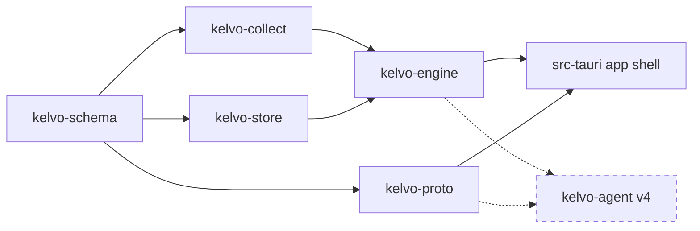
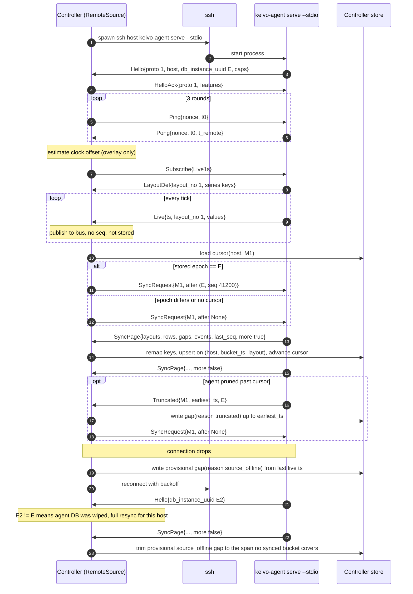
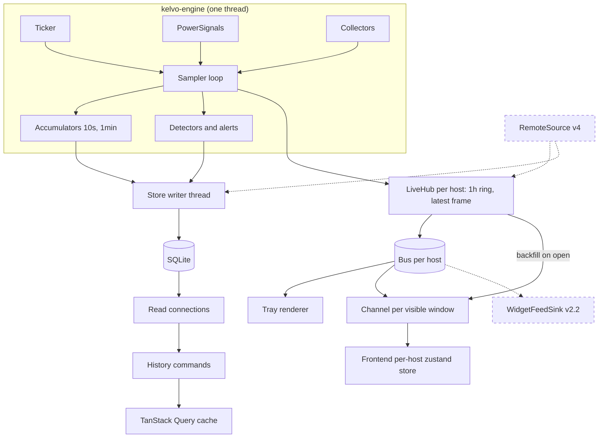
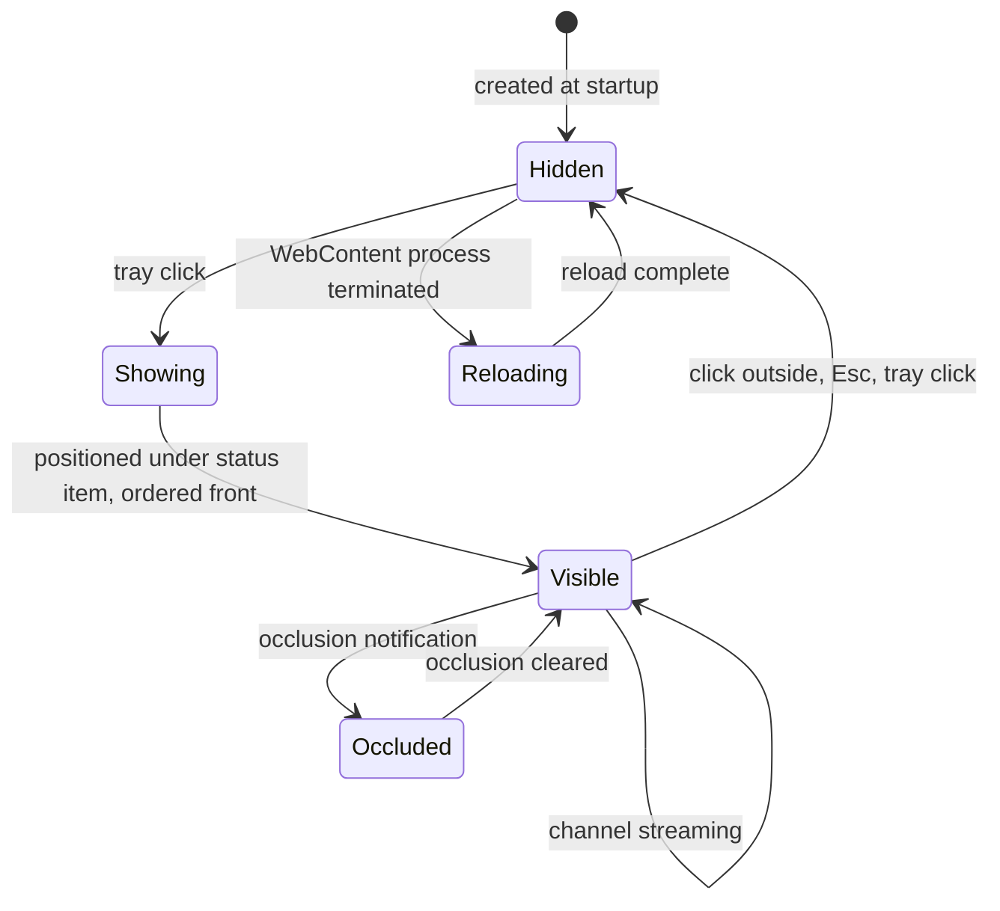

# Architecture

This is the system design that every version builds on. The version docs describe what each release adds; this doc describes the shapes those additions plug into. If a version doc and this doc disagree about a type or a boundary, this doc wins and the version doc gets fixed.

The design went through a devil's-advocate review before any code was written. Three items came out of that review as one-way doors: the series data model, stable host identity, and the wire format. They are marked below. Everything else can be changed later at normal cost, though most of it is cheaper to get right now.

Related docs: [README](README.md), [decisions](decisions.md), [design system](design-system.md), [v1](v1-local-monitor.md), [v2](v2-customization-widgets.md), [v3](v3-native-distribution.md), [v4](v4-remote-hosts.md).

## Contents

1. [Repository layout](#repository-layout)
2. [Crates and dependency direction](#crates-and-dependency-direction)
3. [Infrastructure laid in v1](#infrastructure-laid-in-v1)
4. [Engine](#engine)
5. [Store](#store)
6. [Sync protocol](#sync-protocol)
7. [Data flow](#data-flow)
8. [App shell](#app-shell)
9. [Frontend](#frontend)
10. [Performance budget](#performance-budget)
11. [Platform and entitlement gating](#platform-and-entitlement-gating)
12. [Linux cross-check CI](#linux-cross-check-ci)
13. [Deliberately deferred](#deliberately-deferred)

## Repository layout

The repo becomes a Cargo workspace plus a Bun app. Today it is the untouched `create-tauri-app` scaffold (`src-tauri/` with one crate named `kelvo`, `src/` with the template React app). Phase 0 of v1 moves Rust logic into `crates/` and leaves `src-tauri/` as a thin app shell.

```
kelvo/
  Cargo.toml                workspace root (members: crates/*, src-tauri)
  plan/                     planning docs
  crates/
    kelvo-schema/          metric catalog, SeriesKey, HostInfo, Capabilities, alert-rule data, typed Snapshot view
    kelvo-proto/           framing, CBOR codec, handshake, message types
    kelvo-collect/         Collector trait; macos/ (sysinfo, IOReport, SMC/HID, IOKit, NetworkStatistics); linux/ (v4)
    kelvo-store/           series interning, layouts, tier tables, gaps, cursors, queries, pruning
    kelvo-engine/          sampler loop, Ticker + PowerSignals traits, accumulators, detectors, alerts, bus
    kelvo-agent/           (v4) headless binary: engine + proto server on stdio
  src-tauri/                app shell: HostRegistry, LocalSource, settings/layout owner, tray, windows, commands
  src/
    core/                   plain TypeScript, no React
    app/                    React
  native/KelvoWidgets/     (v2.2) Swift WidgetKit extension, Xcode project
  scripts/
    perf.sh                 engine CPU gate (make perf)
    bench-coalition.sh      whole-app CPU and footprint per scenario (make bench)
    bench-vs-stats.sh       tray-only Kelvo vs Stats (make bench-vs-stats)
```

## Crates and dependency direction

Dependencies run one way. `kelvo-schema` is the root and knows nothing about I/O. `kelvo-proto`, `kelvo-collect` and `kelvo-store` each depend on schema and on nothing else in the workspace. `kelvo-engine` depends on collect and store. The app shell and the agent depend on engine and proto. There are no cycles, and the rule is enforced by the Cargo graph itself: a crate cannot import something it does not list.



| Crate | Owns | Must not |
|---|---|---|
| `kelvo-schema` | Metric catalog (IDs, units, kinds), `SeriesKey`, `Labels`, `HostId`, `HostInfo`, `Capabilities`, `Entitlement`, alert rule data, the `Snapshot` view and its builder, the documented 2^53 bound on integers sent to JS | Do I/O, depend on tokio, depend on any OS API |
| `kelvo-proto` | Length-prefixed framing, CBOR encode/decode via `ciborium`, `Message` enum, handshake and version negotiation, skew fixtures | Know about SQLite or collectors |
| `kelvo-collect` | `Collector` trait, per-OS collector sets, IOReport delta logic (vendored from macmon), SMC/HID, sysinfo wrappers | Write to the store, hold timers, decide cadence on its own |
| `kelvo-store` | SQLite schema and migrations, the single writer, read connections, series and layout interning, tier tables, gaps, process tables, events, cursors, pruning, budget enforcement | Sample anything, talk to the webview |
| `kelvo-engine` | Sampler loop, `Ticker` and `PowerSignals` traits, cadence scheduling, 1s ring buffer, rollup accumulators, event detectors, alert evaluation, the bus; history housekeeping (`Housekeeping`: the prune schedule, the low-disk check, `HistoryHealth`) and process view shaping (`ProcessView`, `select_processes`), which the agent needs as much as the app | Know about Tauri or windows |
| `src-tauri` | `HostRegistry`, `LocalSource`, settings and layout ownership, tray rendering, popover panel, window and channel lifecycle, commands and events (tauri-specta) | Contain metric logic that the agent would also need |
| `kelvo-agent` (v4) | `serve --stdio`, install/update self, user-level launchd/systemd unit | Depend on Tauri |

The test for whether code belongs in the shell or in a crate: if `kelvo-agent` would need it on a headless Linux box, it does not belong in `src-tauri`.

## Infrastructure laid in v1

These nine items exist in v1.0 even though only v2, v3 or v4 fully needs them. Each one is cheap now and expensive to retrofit. Each section gives the reason and a type sketch. Sketches are indicative: field names can change during implementation, but the shape should not without a decision entry.

### 1. Series data model (one-way door)

Storage and sync work on series, not typed structs. A series is identified by a `metric_id` plus a set of labels, for example `cpu.load{core=7}`, `disk.read{dev=disk3}` or, on Linux in v4, `cgroup.mem{unit=nginx.service}`. Series are interned per host into the `series` table, and rows reference an immutable layout (an ordered list of series IDs) rather than naming columns.

The reason is that the set of things we measure changes underneath us. Disks and network interfaces are hot-plugged, an M4 Max has a different core count than an M1, a Linux server has 64 cores, containers come and go every few minutes. A typed `struct CpuSample { cores: [f32; 12] }` breaks on all of those, and a schema migration per chip is not a plan. With series, a new disk is a new series and a new layout; nothing else changes.

The typed `Snapshot` is a convenience view built from series. The UI and the tray consume it because `snap.cpu.total` is nicer than a lookup. It is never stored or synced. If the Snapshot shape changes, no data on disk or on the wire changes.

```rust
// kelvo-schema

/// Dotted, stable, lowercase. Never reused for a different meaning.
#[derive(Clone, Debug, PartialEq, Eq, Hash, PartialOrd, Ord, Serialize, Deserialize)]
pub struct MetricId(pub Cow<'static, str>); // "cpu.load", "power.cpu", "thermal.zone"

/// Sorted, small. Keys and values are short strings.
#[derive(Clone, Debug, Default, PartialEq, Eq, Hash, PartialOrd, Ord, Serialize, Deserialize)]
pub struct Labels(pub SmallVec<[(CompactString, CompactString); 2]>);

#[derive(Clone, Debug, PartialEq, Eq, Hash, PartialOrd, Ord, Serialize, Deserialize)]
pub struct SeriesKey {
    pub metric: MetricId,
    pub labels: Labels,
}
// Display form: cpu.load{core=7}, disk.read{dev=disk3}

pub struct MetricDef {
    pub id: MetricId,
    pub unit: Unit,            // Percent, Hz, Watts, Celsius, BytesPerSec, Bytes, Rpm, Count
    pub kind: MetricKind,      // Gauge | Rate | Counter (counters are converted to rates in collect)
    pub label_keys: &'static [&'static str],
    pub module: Module,        // Cpu, Gpu, Memory, Power, Sensors, Network, Disk, Battery
    pub max_cardinality: Option<u16>, // e.g. 32 for container series in v4
}

pub static CATALOG: &[MetricDef] = &[ /* ... */ ];
```

```rust
// kelvo-store (interned forms; never leave the DB)

pub struct SeriesId(pub u32);
pub struct LayoutId(pub u32);

/// Immutable once minted. A new layout is minted whenever the series set changes.
pub struct Layout {
    pub id: LayoutId,
    pub host: HostRef,
    pub series: Arc<[SeriesId]>, // order defines blob positions
}
```

```rust
// kelvo-schema: the view, built from one frame of series values

pub struct Snapshot {
    pub host: HostId,
    pub ts_ms: i64,
    pub cpu: Option<CpuView>,       // None means the host has no such module
    pub gpu: Option<GpuView>,
    pub memory: Option<MemoryView>,
    pub power: Option<PowerView>,
    pub sensors: Option<SensorsView>,
    pub network: Option<NetworkView>,
    pub disk: Option<DiskView>,
    pub battery: Option<BatteryView>,
}

pub struct CpuView {
    pub total: f32,
    pub user: f32,
    pub system: f32,
    pub clusters: Vec<ClusterView>, // P/E, with freq_hz and residency
    pub cores: Vec<CoreView>,       // index, cluster, load
}

impl Snapshot {
    /// Missing series produce None fields, never zeros.
    pub fn from_frame(host: HostId, frame: &FrameView<'_>, catalog: &Catalog) -> Snapshot { /* ... */ }
}
```

The "missing produces None, never zero" rule in `from_frame` is how the never-interpolate principle reaches the UI. A zero is a measurement; a `None` is a gap.

### 2. Stable host identity (one-way door)

Each machine gets a random UUID on first run, persisted in the app's data directory and in the store's `hosts` table. `HostId` is that UUID everywhere outside SQLite: in commands, channels, events, the proto, and the frontend's per-host stores. Being local is a column of the controller's own `hosts` table, not a special ID and never something a peer says: the proto carries a `HostIdentity`, and the controller decides `is_local` when it stores the host. At most one stored host is local, enforced by a partial unique index (D-064).

The id is bound to the machine (D-071). `host-id` holds the UUID and a `machine=` token, a SHA-256 of the UUID and the Mac's `IOPlatformUUID`. A token that does not match this Mac means the data directory was copied from another one (Migration Assistant, a disk clone, a restore to new hardware), so this Mac makes a new id instead of running as a second copy of the other. The copied store keeps the old host's row and rows as a non-local host, which retention ages out. Two rules back this up where the token cannot help: the store refuses to upsert a non-local host whose UUID is its local host's (`StoreError::HostConflict`), and the v4 handshake must reject a peer whose `HostIdentity.id` equals the controller's own local id rather than store or merge it.

v1 has exactly one host, so this looks like overhead. The point is that every command signature, every TanStack Query key and every zustand store is already `hostId`-scoped when v4 adds a second host. Retrofitting a host parameter into every call site later is the kind of change that touches the whole codebase and introduces bugs where "local" was assumed.

Inside SQLite the UUID is interned to a small integer (`HostRef`) to keep rows compact, the same way series are interned. `HostRef` never leaves the database.

```rust
// kelvo-schema
#[derive(Clone, Copy, Debug, PartialEq, Eq, Hash, Serialize, Deserialize, specta::Type)]
pub struct HostId(pub Uuid);

// What a host says about itself: the proto `Hello` carries this.
#[derive(Clone, Debug, Serialize, Deserialize)]
pub struct HostIdentity {
    pub id: HostId,
    pub display_name: String,      // "MacBook Pro"
    pub info: HostInfo,
}

// The controller's view: a HostIdentity plus is_local. Stored and sent over IPC, never
// to a peer.
#[derive(Clone, Debug, Serialize, Deserialize, specta::Type)]
pub struct HostRecord {
    pub id: HostId,
    pub is_local: bool,
    pub display_name: String,
    pub info: HostInfo,
}

#[derive(Clone, Debug, Serialize, Deserialize, specta::Type)]
pub struct HostInfo {
    pub os: OsKind,                // MacOs | Linux
    pub os_version: String,
    pub model: Option<String>,     // "Mac15,8"
    pub chip: Option<String>,      // "Apple M3 Max"
    pub chip_known: bool,          // false drives the unknown-chip state
    pub cpu_topology: Vec<ClusterInfo>,
    pub mem_total_bytes: u64,
    pub boot_time_ms: i64,
}
```

### 3. Wire format and version skew (one-way door)

`kelvo-proto` defines length-prefixed frames (u32 big-endian length, then a CBOR body via `ciborium`). A connection starts with a handshake that exchanges protocol version, host identity, DB instance UUID and capabilities. Frames carry series-model data, and a receiver ignores any `metric_id` it does not know. That combination lets a v4.3 controller talk to a v4.1 agent and the reverse.

CBOR was picked over JSON because frames are numeric-heavy and sent every second over SSH, and over protobuf because serde derive keeps the types in one place without a codegen step. It is self-describing, so an old decoder can skip fields it does not know.

The webview never sees CBOR. It gets JSON through tauri-specta. That means nothing in the normal app exercises the codec until v4, which is why a codec round-trip and skew test runs in CI from v1: fixtures encoded by the previous release are decoded by current code, and fixtures from current code are decoded by a pinned copy of the previous decoder.

```rust
// kelvo-proto

pub const PROTO_VERSION: u16 = 1;
pub const MIN_COMPATIBLE: u16 = 1;

#[derive(Serialize, Deserialize)]
#[serde(tag = "t", content = "c")]
pub enum Message {
    Hello(Hello),
    HelloAck(HelloAck),
    Ping { nonce: u64, t0_ms: i64 },
    Pong { nonce: u64, t0_ms: i64, t_remote_ms: i64 },

    // Live, ephemeral, no seq
    Subscribe { tiers: Vec<LiveTier> },     // v1: only Live1s
    Unsubscribe,
    LayoutDef(WireLayout),                  // session-scoped layout number -> SeriesKeys
    Live(LiveFrame),
    CapabilitiesChanged(Capabilities),

    // Durable, cursor-based
    SyncRequest(SyncRequest),
    SyncPage(SyncPage),
    Truncated { tier: Tier, earliest_ts_ms: i64, epoch: Uuid },

    // Reserved in v1, first used in v4 by the fleet view
    HostSummary(HostSummary),

    Error { code: ErrorCode, message: String },

    #[serde(other)]
    Unknown, // newer peer sent a message type we do not know: log and skip
}

pub struct Hello {
    pub proto_version: u16,
    pub min_compatible: u16,
    pub app_version: String,
    pub host: HostIdentity,          // never is_local: that is the receiver's call
    pub db_instance_uuid: Uuid,
    pub capabilities: Capabilities,
    pub features: BTreeSet<String>,  // negotiated optional behaviours, e.g. "zstd-pages",
                                     // and the SyncPage row kinds ("rows.buckets", ...)
}

pub struct WireLayout {
    pub layout_no: u32,              // valid only within this connection
    pub series: Vec<SeriesKey>,      // keys travel as strings, never as local intern IDs
}

pub struct LiveFrame {
    pub ts_ms: i64,                  // remote clock, authoritative for that host
    pub layout_no: u32,
    pub values: Vec<f32>,            // NaN = series present in layout but not sampled this tick
}

pub struct HostSummary {
    pub ts_ms: i64,
    pub online: bool,
    pub headline: Vec<(SeriesKey, f32)>, // a handful of values for fleet cards
}
```

Whether `#[serde(other)]` on an adjacently tagged enum skips unknown variants cleanly when the unknown variant carries content is the first thing the skew test checks (unverified). If it does not, the fallback is to decode the tag first and dispatch manually.

### 4. Sync cursors

Every persisted row (tier buckets, gaps, events, process snapshots) gets a `seq` that is monotonic within one database file. Cursors are `(db_instance_uuid, seq)` and are kept per `(host, tier)` on the controller. The `db_instance_uuid` is written to `meta` when the database is created; a reinstall or a wiped DB produces a new one, and a mismatch on reconnect triggers a full resync for that host.

Only closed buckets of persisted tiers are synced. The controller stores the agent's rollups as-is and never recomputes them, so the same hour looks the same on both machines. If the agent has pruned past the controller's cursor, it replies `Truncated { earliest_ts_ms }` and the controller writes a gap row for the missing span rather than drawing a line across it. Ingest upserts on `(host, bucket_ts, layout_id)` within each tier table, so replaying a page after a dropped connection is harmless.

Each row kind in a `SyncPage` (buckets, gaps, events, and any kind added later) travels only when both sides listed its `rows.*` feature in `Hello`. An older receiver would otherwise drop a kind it does not know as an unknown field while its cursor moved past those rows for good. The receiver stores the negotiated kinds with its cursor; when it later negotiates a kind the cursor did not cover, it resyncs that tier from the start (D-064).

The 15-minute tier (D-076) is one such kind: `rows.m15` gates the M15 rows, which sync on their own `(host, M15)` cursor. The agent's roll-down of minutes into 15-minute rows is not a truncation for a receiver that negotiated `rows.m15`, since the rows reach it on the M15 cursor. A receiver without it, whose M1 cursor missed minutes that were rolled down, gets `Truncated` at the roll cut and writes a `truncated` gap. An older build decodes `"m15"` as `Tier::Unknown` (D-040).

The live stream is ephemeral and carries no `seq`. Timestamps come from the agent's clock. The handshake estimates the clock offset with a few Ping/Pong rounds, and that offset is used only when overlaying two hosts on one chart, never to rewrite stored timestamps.

v1 uses none of this over a network, but v1 writes `seq` on every row and creates `db_instance_uuid` at DB creation. Adding `seq` to an existing populated table later means a backfill that has no correct answer for ordering.

```rust
// kelvo-schema
pub enum Tier { Live1s, S10, M1, M15, Unknown }   // S10, M1 and M15 are persisted and synced

pub struct Cursor {
    pub epoch: Uuid,   // remote db_instance_uuid
    pub seq: i64,
}

// kelvo-proto
pub struct SyncRequest {
    pub tier: Tier,
    pub after: Option<Cursor>,   // None = from earliest
    pub max_rows: u32,
}

pub struct SyncPage {
    pub tier: Tier,
    pub epoch: Uuid,
    pub layouts: Vec<WireLayout>,  // every layout referenced by rows in this page
    pub rows: Vec<WireBucket>,     // each list empty unless its rows.* feature was negotiated
    pub gaps: Vec<WireGap>,
    pub events: Vec<WireEvent>,
    pub last_seq: i64,
    pub more: bool,
}
```

### 5. Sources produce; the UI reads the local store

A `Source` is anything that produces data for one host. Sources push live frames onto the bus and persisted rows into the controller's own store. Every UI query, live or history, goes to the controller by `host_id`. The UI never asks a remote machine directly.

This puts the abstraction at the right layer. If instead the UI queried "a source" for history, every fleet card and every Timeline scroll on a remote host would be an SSH round trip, and an offline host would show nothing. With sources as producers, an offline host still has its mirrored history, and the fleet view is a local query.

In v1, `LocalSource` wraps the in-process engine. Later it could become "spawn `kelvo-agent` on a unix socket" without the UI noticing. In v4, `RemoteSource` speaks `kelvo-proto` over `ssh host kelvo-agent serve --stdio` and writes into the same store.

```rust
// src-tauri (trait lives in kelvo-engine so the agent can reuse it)

pub trait Source: Send + Sync + 'static {
    fn host(&self) -> HostRecord;
    fn capabilities(&self) -> Capabilities;
    /// Begin producing. Returns a handle whose drop stops the source.
    fn start(self: Arc<Self>, sink: SourceSink) -> Result<SourceHandle, SourceError>;
}

pub struct SourceSink {
    pub live: LiveHub,               // per host: the bus plus the 1h ring, latest frame and status (D-066)
    pub store: Option<store::Writer>, // closed buckets, gaps, events, process snapshots
}

pub struct HostRegistry {
    hosts: RwLock<HashMap<HostId, HostEntry>>,
}

struct HostEntry {
    record: HostRecord,
    source: Arc<dyn Source>,
    handle: Option<SourceHandle>,
}
```

### 6. Platform seams in the engine

The engine never calls a timer API or a power API directly. It takes a `Ticker` and a `PowerSignals` implementation. On macOS these are a GCD `DispatchSource` timer plus NSWorkspace sleep/wake, screen lock, display sleep and Low Power Mode notifications. On Linux (v4) they are a `timerfd` plus logind's `PrepareForSleep` signal. Tests use a fake ticker that advances on demand, which is how the accumulator and gap logic get deterministic tests.

Collectors are `cfg(target_os)`-gated, and each declares its cadence and the entitlements it needs. The second part matters for the App Store question in v3: a sandboxed build can drop collectors at registration time and the UI shows "not available in this edition" through the normal capabilities path.

```rust
// kelvo-engine
pub trait Ticker: Send + 'static {
    /// Blocks until the next tick.
    fn next(&mut self) -> Tick;
    fn reconfigure(&mut self, period: Duration, leeway: Duration);
}

pub struct Tick {
    pub n: u64,
    pub wall_ms: i64,
    pub continuous_ns: u64, // mach_continuous_time on macOS; advances during sleep
}

pub trait PowerSignals: Send + Sync + 'static {
    fn current(&self) -> PowerState;
    fn subscribe(&self) -> crossbeam_channel::Receiver<PowerEvent>;
}

pub struct PowerState {
    pub on_battery: bool,
    pub low_power_mode: bool,
    pub display_asleep: bool,
    pub screen_locked: bool,
}

pub enum PowerEvent {
    WillSleep,
    DidWake,
    DisplaySleep(bool),
    ScreenLocked(bool),
    LowPowerMode(bool),
    OnBattery(bool),
}
```

```rust
// kelvo-collect
pub trait Collector: Send + 'static {
    fn id(&self) -> CollectorId;
    fn cadence(&self) -> Cadence;
    fn required_entitlements(&self) -> &'static [Entitlement];
    /// Called once at start and on capability-change hints. Reports which series it can produce.
    fn probe(&mut self) -> Probe;
    /// Append values for this tick. Must not allocate per call in steady state.
    fn sample(&mut self, tick: &Tick, out: &mut SampleBuf) -> Result<(), CollectError>;
}

pub enum Cadence {
    EveryTick,
    EveryN(u32),               // multiple of the base tick
    OnDemand,                  // sampled only while a consumer asks (per-process GPU, v1.2; per-process net
                               // also samples on every process tick while Network history is on, D-089)
    Adaptive { idle_n: u32, visible_n: u32 }, // processes: 10s idle, every tick while visible
}

pub enum Probe {
    Supported(Vec<SeriesKey>),
    Unsupported { reason: UnsupportedReason }, // UnknownChip, MissingEntitlement, NoHardware
}

#[derive(Clone, Copy, PartialEq, Eq, Hash, Serialize, Deserialize, specta::Type)]
pub enum Entitlement {
    None,                 // sandbox-safe public APIs
    IoReport,             // private IOReport framework
    SmcUserClient,        // AppleSMC IOKit user client
    HidSensors,           // IOHIDEventSystemClient thermal sensors
    NetworkStatistics,    // private NetworkStatistics framework
    IoRegistryGpuClients, // per-process GPU time
}
```

### 7. Alerts and detectors live in the engine

Event detectors (fans ramped, thermal state change, sustained process, power spike) and alert rules evaluate series keys inside the engine, not in the UI. Rule definitions are plain serializable data in `kelvo-schema`. That way the same rule runs on the local engine in v1.2 and on a remote agent in v4, where the controller pushes rule data to the agent and the agent forwards fired alerts.

```rust
// kelvo-schema
pub struct AlertRule {
    pub id: Uuid,
    pub name: String,
    pub when: Condition,
    pub for_secs: u32,          // sustained duration
    pub cooldown_secs: u32,
    pub enabled: bool,
}

pub enum Condition {
    Threshold { series: SeriesSelector, op: Cmp, value: f32 },
    ThermalStateAtLeast(ThermalState),
    ProcessCpuAbove { percent_of_core: f32 },
}

pub struct SeriesSelector {
    pub metric: MetricId,
    pub labels: Labels,         // empty = any; matched as a subset
}
```

### 8. Single writers

Exactly one process writes a given SQLite file, and inside that process exactly one thread holds the write connection. Readers open their own read-only connections, which WAL mode allows without blocking the writer.

This is enforced, not assumed (D-064):

- `Store::open` takes an exclusive `flock` on `<file>.lock` and holds it until the writer stops. A second opener gets `StoreError::Locked`, which the app reports as history unavailable for the reason `locked`.
- The app runs as a single instance: a second launch focuses the first and exits.
- Debug builds use their own bundle identifier, and so their own data directory, so a dev build never opens the installed app's history.
- Long writer work (pruning) yields to queued flushes between batches, and a queued shutdown ends it early.

The same rule applies to settings and layouts. Rust owns them. They are stored with `tauri-plugin-store`, but only Rust writes that file. Windows read and change settings through commands, and every change emits a `settings-changed` event carrying the full new settings and a revision number. Each window keeps a read-only zustand mirror that replaces itself on that event, and invalidates the TanStack Query keys that depend on settings (for example retention changes history queries). Without this, the popover, the dashboard and later the board windows would each hold their own copy and race to save.

Rust also decides when a window's live channel stops. Hidden WKWebView timers are throttled by WebKit, so a webview cannot be trusted to notice it is hidden and unsubscribe. Rust watches window visibility and occlusion and stops sending.

```rust
// src-tauri
#[tauri::command] #[specta::specta]
fn get_settings(state: State<'_, AppState>) -> Settings;

#[tauri::command] #[specta::specta]
fn update_settings(state: State<'_, AppState>, patch: SettingsPatch) -> Result<Settings, SettingsError>;

#[derive(Serialize, specta::Type, tauri_specta::Event)]
struct SettingsChanged { revision: u64, settings: Settings }
```

### 9. Capabilities are dynamic

Capabilities are not fixed at startup. An eGPU is unplugged, a disk is ejected, a Linux container exits. The engine re-probes on hints (IOKit match notifications on macOS, periodic re-probe for cheap collectors) and emits `CapabilitiesChanged`. The UI follows three rules:

| Situation | What the UI shows |
|---|---|
| A series was present and then disappears | A gap from that point, never a flat line or a zero |
| A module the host never had | The "not available" state |
| A collector exists but the chip is not recognised | The unknown-chip state with "Share sensor dump" |

```rust
// kelvo-schema
#[derive(Clone, Serialize, Deserialize, specta::Type)]
pub struct Capabilities {
    pub modules: BTreeMap<Module, ModuleCap>,
    pub revision: u64,
}

pub enum ModuleCap {
    Available { series: u32 },
    Unsupported(UnsupportedReason),
    NotPresent,
}
```

## Engine

The engine runs on one dedicated thread at utility QoS. On macOS the `Ticker` is a GCD `DispatchSource` timer with about 10% leeway so the kernel can coalesce wakeups. One base tick (1s by default; 0.5, 1, 2, 5, 10, 30 or 60 s per settings) drives every collector. A collector's cadence is a wall-clock minimum period checked on each tick, not a tick multiple, so disk capacity stays 60 s and temperatures 5 s at any interval; a period shorter than the tick runs every tick (D-061). There is one timer in the whole engine, not one per collector.

| Collector | Data source | Cadence (wall clock) | Persisted | Entitlement |
|---|---|---|---|---|
| CPU load, user/system, per core | `host_processor_info` via sysinfo (narrow refresh kinds) | every tick | yes | None |
| Cluster frequency and residency | IOReport "CPU Stats" deltas | every tick while a window streams the host, every 10 s otherwise (tray-only, D-061) | yes | IoReport |
| Memory pressure and composition | `host_statistics64`, `sysctl vm.*` | every tick | yes | None |
| GPU frequency and residency | IOReport "GPU Stats" | as cluster frequency | yes | IoReport |
| GPU utilisation | IOAccelerator `PerformanceStatistics` | every tick | yes | None |
| Power by component (GPU/ANE/DRAM) | IOReport "Energy Model" deltas | as cluster frequency | yes | IoReport |
| System power; CPU power on verified chips | SMC `PSTR`; P-cluster keys scaled live to PMP (D-054) | every tick | yes | SmcUserClient |
| Network interface rates | `getifaddrs` `if_data` counters | every tick | yes | None |
| Disk I/O rates | IOBlockStorageDriver statistics | every tick | yes | None |
| SoC thermal zones, fans | SMC user client, IOHID sensors (vendored from macmon) | temperatures every 5 s (D-055), fans every 2 s | yes | SmcUserClient, HidSensors |
| Battery charge, health, cycles | IOPowerSources, AppleSmartBattery | every 10 s, slow fields every 60 s | yes | None |
| Processes (CPU, mem, threads, idle wakeups, energy) | `proc_pid_rusage`, `proc_pidinfo` | every 10 s, every tick while a process view is visible | snapshots | None |
| Disk capacity | `statfs` | every 60 s | yes | None |
| Per-process network (v1.2; history D-089) | NetworkStatistics, in process (own-uid flows only, D-081, D-082); bytes per app identity | on the processes collector's ticks: every 10 s, every tick while a process view is visible (always on while the Network history setting is on; with it off, only while a view asks) | per-app bytes (`proc_net_*`) | NetworkStatistics |
| Per-process GPU time (v1.2) | IORegistry `AGXDeviceUserClient` `AppUsage` `accumulatedGPUTime` (verified unprivileged, D-085) | on demand | no | IoRegistryGpuClients |

IOReport subscriptions are built from the channel groups that active collectors need, and sampled as deltas against the previous sample. sysinfo is configured with narrow refresh kinds and never reads process environments.

Back-off is driven by `PowerSignals`. On battery (if "slow down on battery" is on) or in Low Power Mode the base tick doubles, capped at 60 s (D-061). On display sleep or screen lock the engine keeps persisting at the slower tick but the tray stops redrawing. On `WillSleep` the engine closes open buckets, writes a gap start, and stops the ticker. On `DidWake` it writes the gap end using the continuous clock to measure the sleep span, then restarts. Sleep gaps are explicit rows, so charts can draw a sleep band instead of guessing from missing buckets.

A wall clock that steps (NTP, a manual change) is also treated like a sleep (D-064). Each tick compares the wall-clock delta with the continuous-clock delta, and a difference of more than two base ticks counts as a step. The engine then:

- flushes and resets the accumulators;
- writes a `clock_changed` gap;
- publishes a new `layout_no` so subscribers drop what they drew.

After a step back it persists nothing until the clock passes the newest bucket already written, so no older bucket is upserted twice, and the host's ring clears itself when the older frame arrives.

Pausing works the same way. When the user pauses sampling, the engine closes open buckets, opens a `paused` gap and stops the collectors; resuming closes the gap and restarts them. The bus stays up while paused so windows still receive status messages. Pause is a real stop rather than a frozen UI, so history shows that nothing was measured.

Accumulators sit between the sampler and the store. Each persisted tier has an accumulator per layout that tracks min, max, sum and count per series and closes on bucket boundaries (10s and 1min, aligned to wall-clock multiples). Closing a bucket emits one row to the store's ingest channel. Event detectors (v1.2) consume the same per-tick values and emit event rows, which also get a `seq`.

The bus is a `tokio::sync::broadcast` channel per host carrying `Arc<LiveFrame>` plus layout and capability changes, process rows and status changes. A slow subscriber lags rather than blocking the engine. A window's stream that lags catches up from the ring with exactly the span it missed. Every source publishes through its host's `LiveHub` (D-066), which records each message before it goes on the bus: the 1-hour ring buffer of raw frames used to backfill windows, the latest frame (whose time is "now" on that source's clock) and the latest status. The ring lives with the host, not in the engine, so a v4 `RemoteSource` backfills windows the same way.

## Store

### Tiers and retention

| Tier | Where | Bucket | Retention (default) | Contents |
|---|---|---|---|---|
| Live | memory ring buffer | 1s (base tick) | 1 hour | raw values per tick |
| S10 | `tier_10s` table | 10s | 24 hours | min/max/avg per series |
| M1 | `tier_1m` table | 1 min | 7 days (or the retention, if shorter) | min/max/avg per series |
| M15 | `tier_15m` table | 15 min | the rest of the retention: 30 days by default, configurable | min/max/avg per series, rolled down from M1 |
| Process snapshots | `proc_snap` | 10s | 72 hours | top processes per snapshot |
| Process top 5 | `proc_top_1m` | 1 min | to 7 days | top 5 by CPU per minute |
| Process top 5, 15 min | `proc_top_15m` | 15 min | same as M15 | top 5 by mean CPU over the minutes present |
| Per-app network, 10 s | `proc_net_10s` | 10s | 72 hours | interface totals, top 20 apps by rx+tx, the rest folded into "other apps" (D-089) |
| Per-app network, 1 min | `proc_net_1m` | 1 min | 7 days (or the retention, if shorter); written live beside 10 s | as above, summed exactly |
| Per-app network, 15 min | `proc_net_15m` | 15 min | same as M15 | as above, summed exactly from minutes |
| Gaps, events | `gaps`, `events` | n/a | the retention | explicit rows |

Minutes older than 7 days are rolled down into 15-minute rows by the prune (D-076): min of mins, max of maxes, the mean of the minute averages that have a value (blobs carry no sample counts, so each sampled minute weighs alike), and NaN where no minute in the 15 had a value. Rows stay one per `(bucket, layout)`, so a layout change inside a quarter gives two rows, as it does for minutes. Gaps are kept as rows and never filled in. The rolled minutes are deleted in the same transaction, and a `pruned` row (`m1_rolled`) records the roll cut and the highest rolled `seq`. A history read in M15 includes the minutes still in `tier_1m`, folded into the same 15-minute slots and weighed by width, so a range that crosses the 7-day line has no seam. `Auto` reads S10 while it covers the start of the range, then M1 while minutes do, else M15.

There is one table per tier, not one per day. Per-day partitions would make range queries union across tables and would make a cursor span table boundaries. Pruning is a batched `DELETE FROM tier_1m WHERE rowid IN (SELECT rowid FROM tier_1m WHERE host_id = ? AND bucket_ts < ? LIMIT 5000)` loop followed by `PRAGMA incremental_vacuum`, which is good enough for this size. (A plain `DELETE ... LIMIT` needs a compile option that bundled SQLite builds usually leave off.)

The database is created with `auto_vacuum=INCREMENTAL` (it can only be set before the first table exists), WAL mode with a `journal_size_limit`, and `synchronous=NORMAL`. The writer batches inserts and commits every 5 minutes, and the engine also flushes before sleep, on wake, on pause and resume (including a wake while paused), when a module is switched off or on, after reopening gaps that a clock-step discard deleted, on a store swap and at shutdown; the `discard_from` itself commits on its own and is retried until it does (D-070). A crash loses at most 5 minutes of persisted buckets; the live views do not notice because recent data comes from the ring buffer.

### DDL

```sql
CREATE TABLE meta (
  key   TEXT PRIMARY KEY,
  value BLOB NOT NULL
);
-- rows: db_instance_uuid, schema_version, next_seq, created_at_ms

CREATE TABLE hosts (
  id         INTEGER PRIMARY KEY,        -- HostRef, never leaves the DB
  uuid       TEXT NOT NULL UNIQUE,       -- HostId
  is_local   INTEGER NOT NULL,           -- this controller's machine; never from a peer
  name       TEXT NOT NULL,
  info       BLOB NOT NULL,              -- CBOR HostInfo
  created_ms INTEGER NOT NULL
);
CREATE UNIQUE INDEX hosts_one_local ON hosts (is_local) WHERE is_local = 1;  -- schema v2

CREATE TABLE series (
  id        INTEGER PRIMARY KEY,
  host_id   INTEGER NOT NULL REFERENCES hosts(id),
  metric_id TEXT NOT NULL,
  labels    TEXT NOT NULL,               -- canonical sorted form: "core=7" or ""
  UNIQUE (host_id, metric_id, labels)
);

CREATE TABLE layouts (
  id         INTEGER PRIMARY KEY,
  host_id    INTEGER NOT NULL REFERENCES hosts(id),
  series_ids BLOB NOT NULL,              -- packed u32 little-endian, order = blob order
  hash       BLOB NOT NULL,              -- of series_ids, for dedupe
  created_ms INTEGER NOT NULL,
  UNIQUE (host_id, hash)
);

-- Same shape for tier_10s, tier_1m and tier_15m (schema v3), each with its _key and _seq index.
CREATE TABLE tier_1m (
  host_id   INTEGER NOT NULL REFERENCES hosts(id),
  bucket_ts INTEGER NOT NULL,            -- ms epoch, bucket start, host clock
  layout_id INTEGER NOT NULL REFERENCES layouts(id),
  seq       INTEGER NOT NULL,
  blob      BLOB NOT NULL                -- f32 LE triples (min, max, avg) per series in layout
);
CREATE UNIQUE INDEX tier_1m_key ON tier_1m (host_id, bucket_ts, layout_id);
CREATE INDEX tier_1m_seq ON tier_1m (host_id, seq);

CREATE TABLE gaps (
  id        INTEGER PRIMARY KEY,
  host_id   INTEGER NOT NULL REFERENCES hosts(id),
  start_ts  INTEGER NOT NULL,
  end_ts    INTEGER,                     -- NULL while open (asleep now)
  module    TEXT,                        -- NULL = whole host; set only for module_disabled (e.g. 'cpu')
  reason    TEXT NOT NULL,               -- sleep | app_not_running | paused | module_disabled | truncated | source_offline
  seq       INTEGER NOT NULL
);
CREATE INDEX gaps_range ON gaps (host_id, start_ts);

CREATE TABLE proc_names (
  id      INTEGER PRIMARY KEY,
  host_id INTEGER NOT NULL REFERENCES hosts(id),
  name    TEXT NOT NULL,
  UNIQUE (host_id, name)
);

CREATE TABLE proc_snap (
  host_id INTEGER NOT NULL REFERENCES hosts(id),
  ts      INTEGER NOT NULL,
  seq     INTEGER NOT NULL,
  blob    BLOB NOT NULL                  -- packed (name_id, pid, cpu, mem, threads, wakeups, energy) x N
);
CREATE UNIQUE INDEX proc_snap_key ON proc_snap (host_id, ts);

CREATE TABLE proc_top_1m (
  host_id   INTEGER NOT NULL REFERENCES hosts(id),
  bucket_ts INTEGER NOT NULL,
  seq       INTEGER NOT NULL,
  blob      BLOB NOT NULL                -- top 5 by CPU
);
CREATE UNIQUE INDEX proc_top_1m_key ON proc_top_1m (host_id, bucket_ts);
-- proc_top_15m (schema v3): same shape and key, 15-minute buckets.

-- Schema v4 (D-089). Same shape for proc_net_10s, proc_net_1m and proc_net_15m, each with its _key index.
CREATE TABLE proc_net_10s (
  host_id   INTEGER NOT NULL REFERENCES hosts(id),
  bucket_ts INTEGER NOT NULL,            -- ms epoch, bucket start, host clock
  seq       INTEGER NOT NULL,
  blob      BLOB NOT NULL                -- header: measured_ms, iface rx/tx bytes, iface rx/tx packets;
                                         -- then (name_id u32, rx u64, tx u64) x N, top 20 by rx+tx;
                                         -- name_id 0 = "other apps" (reserved, not in proc_names)
);
CREATE UNIQUE INDEX proc_net_10s_key ON proc_net_10s (host_id, bucket_ts);

CREATE TABLE events (
  id      INTEGER PRIMARY KEY,
  host_id INTEGER NOT NULL REFERENCES hosts(id),
  ts      INTEGER NOT NULL,
  kind    TEXT NOT NULL,                 -- fans_ramped | thermal_state | sustained_process | power_spike | alert
  payload BLOB NOT NULL,                 -- CBOR, includes attribution (process names as strings)
  seq     INTEGER NOT NULL
);
CREATE INDEX events_range ON events (host_id, ts);
```

Gap reasons, by who writes them: `sleep` (engine, on `WillSleep`), `app_not_running` (store, on startup, from the last persisted bucket to now), `paused` (engine, while the user has paused sampling), `module_disabled` (engine, when a module is switched off in Settings; the row's `module` column names it, and charts for other modules ignore it), `truncated` (v4 controller, when the agent pruned past its cursor) and `source_offline` (v4 controller, when a remote connection drops). `source_offline` gaps are provisional; see the sync protocol below.

The tier tables are ordinary rowid tables with a unique index, not `WITHOUT ROWID`. SQLite's guidance is that `WITHOUT ROWID` suits small rows, and these rows carry a 1 to 2 KB blob. `seq` comes from `meta.next_seq`, incremented inside the same write transaction.

### Budget math

The target is at most 150 MB for 30 days on one host. Before D-076 the dominant cost was 30 days of M1, and its size depends almost entirely on how many series are persisted. The estimate below assumes about 150 persisted series, which is roughly what a 12 to 16 core Apple Silicon Mac produces once per-core load, cluster frequency and residency, power components, a dozen thermal zones, fans, two network interfaces and two disks are counted. It is the original, pre-D-076 estimate; the measured numbers below replace it.

| Table | Rows in window | Bytes per row (blob + overhead) | Estimate |
|---|---|---|---|
| `tier_1m`, 30 days | 43,200 | 150 × 12 B = 1,800 B blob, ~2,050 B with row, index and page slack | ~89 MB |
| `tier_10s`, 24 hours | 8,640 | ~2,050 B | ~18 MB |
| `proc_snap`, 72 hours | 25,920 | top 30 processes × 28 B ≈ 840 B, ~900 B with overhead | ~23 MB |
| `proc_top_1m`, remaining 27 days | 38,880 | 5 × 28 B + overhead ≈ 180 B | ~7 MB |
| gaps, events, series, layouts, names | small | | < 2 MB |
| Total | | | ~139 MB |

That fits under 150 MB with little room, and it tells us where the knobs are. If a machine produces 200 series, M1 alone goes to about 118 MB. The levers, in the order we would reach for them: drop `min` and `max` from the M1 tier for series where the UI only draws the average (saves a third), store min/max as f16 (unverified that the precision is acceptable for temperatures), cap per-core series in M1 to cluster aggregates on very wide hosts, or try a larger `page_size` to reduce slack (unverified gain). The settings page shows the real size on disk, and retention is configurable, so a user can also trade days for bytes.

The synthetic fill test writes 30 days of buckets for a 150-series and a 250-series layout through the real writer, runs pruning, and asserts file size. It runs in CI. Measured with 16 KiB pages (D-057): 139.7 MB for 150 series and 203.4 MB for 250 series before any cap. With the 15-minute tier (D-076: 7 days of minutes, 23 days of 15-minute rows) the same fill measures 69.9 MB for 150 series and 95.7 MB for 250 series. With per-app network history (D-089, 25 apps per bucket) it measures 89.2 MB and 115.0 MB, neither near the cap; what remains is mostly 7 days of minutes, 24 h of 10 s buckets, 72 h of snapshots and the `proc_net_*` tables. Retention is still backed by a hard 150 MB cap including the WAL: when time-based pruning leaves the file over it, the oldest history (15-minute rows first, then minutes, on 15-minute boundaries) is trimmed to 90% of the cap, and the 10 s tier pauses while the disk is almost full. The fill test's third run puts a 111 MB cap on 250 series (92 MB before D-089) to keep that path exercised at scale. The store does the pruning and holds the low-disk guard; `kelvo-engine`'s `Housekeeping` thread decides when they run (first prune 2 min after launch, then hourly or when the retention or limit changes; a free-space check every 5 min) and turns the results into `HistoryHealth`. The app shell starts it and maps that health to its IPC type and the `history-health-changed` event; a v4 agent starts the same thing. The data directory is 0700 and every file Kelvo writes in it 0600 (D-074).

Per-app network history (D-089) adds three tables. This is an estimate, not a measurement: it assumes about 15 apps with traffic in a typical 10 s bucket, and a full 21 rows (top 20 plus "other apps") in minute and 15-minute buckets. The blob header is about 40 B (`measured_ms` plus four u64 interface counters) and each app row 20 B.

| Table | Rows in window | Bytes per row (blob + overhead) | Estimate |
|---|---|---|---|
| `proc_net_10s`, 72 hours | 8,640 a day × 3 = 25,920 | 15 × 20 B + 40 B = 340 B, ~400 B with overhead | ~10 MB |
| `proc_net_1m`, 7 days | 1,440 a day × 7 = 10,080 | 21 × 20 B + 40 B = 460 B, ~520 B with overhead | ~5 MB |
| `proc_net_15m`, remaining 23 days | 96 a day × 23 = 2,208 | ~520 B | ~1 MB |
| Total | | | ~17 MB |

An idle Mac has fewer apps per bucket and comes in under this; a busy one is bounded by the top-20 fold, which caps `proc_net_10s` at about 13.5 MB (25,920 × 520 B). The tables join the prune order and the cap trim like the other process tables. The store-volume gate in `perf_gates` counts them.

Remote hosts in v4 get a bounded mirror per host, defaulting to the M1 and M15 tiers for 30 days, with a per-host disk budget. That budget is decided in [v4-remote-hosts.md](v4-remote-hosts.md).

## Sync protocol

The protocol is only exercised end to end in v4, but its message types and the store's cursor columns exist from v1. The sequence below is the full lifecycle of one remote host connection.



The cursor sync runs once per persisted tier after each handshake and then periodically. Because the controller upserts and never recomputes, replaying a page after a drop produces identical rows.

A `source_offline` gap is provisional. The controller only knows that it stopped hearing from the host, not that the host stopped sampling: the agent usually keeps recording and syncs those buckets after reconnecting. So the controller writes the gap with `provisional = 1` (a column added in v4.0), and once a sync catches up it deletes or trims provisional gaps to the parts no synced bucket covers. A host that never comes back keeps its gap, which is the honest answer. Gaps of every other reason are final when written. Details are in [v4-remote-hosts.md](v4-remote-hosts.md#sync).

## Data flow



Live data takes the top path: sampler, bus, a Tauri `Channel` per visible window, and a per-host zustand store. History takes the bottom path: accumulators, the single writer, SQLite, read connections, a command, and the TanStack Query cache. A Timeline view that ends at "now" stitches the two: it queries history up to the last closed bucket and appends the ring buffer.

## App shell

### Startup

The app starts with the Accessory activation policy (no Dock icon) and a "Show in Dock" setting that switches to Regular. `HostRegistry` is created with the local `HostRecord` (UUID plus `is_local = true`), the store is opened and the local host written into it, `LocalSource` starts the engine, and the tray item is created. A store that cannot be opened (locked, corrupt, too new) or cannot take the host row never stops the launch: history is unavailable with a reason, the engine runs live-only, and `reset_history` moves the file aside and starts a fresh one (D-064). Neither does an unwritable or full data or log directory: logs fall back to stderr, history is unavailable, and a host id that cannot be saved lives in memory for the run (D-071). The popover panel is created hidden at startup so the first open is fast. Launch at login uses `smappservice-rs`. Updates use `tauri-plugin-updater` with our own minisign key.

### Tray rendering pipeline

The tray subscribes to the bus like any other consumer. On each frame it builds the small set of values the selected style needs, quantizes them to what the icon can actually show (a 14 pt bar has 28 device pixels at 2x, so load is quantized to 28 steps), and hashes the quantized frame. If the hash matches the previous frame, it does nothing. Otherwise it renders an RGBA image at 2x with `tiny-skia` (bars, sparkline paths) and `ab_glyph` (values text in a bundled mono font), and sets it as a template image so macOS tints it for light, dark and highlighted states.

The update must set image and template flag in one call, otherwise the icon flickers between untinted and tinted. Blueprint research says the atomic setter needs Tauri 2.12 or later (unverified; check the changelog in phase 0). The tray stops redrawing on display sleep and screen lock, and drops to the 2s cadence on battery. Sampling stays at the base tick, but a changed frame is drawn at most every 2 s (4 s while backed off on battery or Low Power Mode). A change inside that period is held, and a timer draws it 0.5 s after the period if no newer frame came, so the icon never stays stale. Pausing draws at once (D-077). Each update also sets an accessibility label such as "CPU 18 percent, GPU 36 percent, memory 42 percent, 61 degrees".

The cost to watch is WindowServer, not our process: every icon change makes WindowServer recomposite the menu bar. The quantize-and-hash step is what keeps that under budget.

### Popover lifecycle

The popover is a `tauri-nspanel` non-activating `NSPanel`, so opening it does not steal focus from the app the user is in. It is created hidden at startup and kept warm; its memory counts against the panel budget below.



On `Showing`, Rust sends a ring-buffer backfill for the span the channel missed (on first subscribe, the requested window, 60 s by default) and then resumes the live channel. On `Hidden` or `Occluded`, Rust stops sending. The webview does not decide this, for the throttling reason in item 8. If the WKWebView's WebContent process dies (memory pressure, crash), the panel reloads its URL the next time it is hidden; how to hook that termination callback through Tauri's WebView API needs checking in phase 0 (unverified).

### Window and channel lifecycle

| Window | Label | Created | Live channel runs while |
|---|---|---|---|
| Popover | `popover` | at startup, hidden | visible and not occluded |
| Dashboard | `dashboard` | on Open dashboard, kept after close (hidden) for 5 min, then destroyed | visible and not minimised |
| Onboarding | `onboarding` | first run only | visible |
| Desktop board (v2.1) | `board-<display>` | one per display when widgets exist | visible, not occluded, screen awake, not in a fullscreen Space |

A window asks for a live subscription with a command that passes a `Channel<LiveMsg>`. Rust stores the channel keyed by window label and host, and owns starting and stopping it. When the window closes, Rust drops the channel. A label the window code has not reported visible counts as hidden.

The command is async, so the backfill is serialized on a runtime worker, not the main thread. It sends the last two minutes before returning; older history follows in chunks of at most 600 rows, newest first, once the first frame is out. A window that names `series` gets a channel projected to those series in Rust, so a board widget showing two series does not receive the whole layout; `min_period_ms` thins frames for slow widgets. Frames and backfills carry a `timeline` number that the engine bumps only on a clock step (D-072); a new `layout_no` is no longer a step signal. A window holding rows on another timeline drops the rows at or after the new timeline's first row and keeps the older ones. After a step, or on a resume whose latest frame is on another timeline, the stream sends the new timeline from its first row in the ring.

```rust
#[tauri::command] #[specta::specta]
async fn subscribe_live(
    window: tauri::Window,
    state: State<'_, AppState>,
    host: HostId,
    channel: tauri::ipc::Channel<LiveMsg>,
    backfill_ms: Option<u32>,                // default 60 s, at most the ring's hour
    series: Option<Vec<SeriesSelector>>,     // default every series
    min_period_ms: Option<u32>,              // default every tick
) -> Result<SubscriptionInfo, CommandError>; // the stream id, the recent span sent, the older span to come

#[tauri::command] #[specta::specta]
fn set_process_interest(
    window: tauri::Window,
    state: State<'_, AppState>,
    host: HostId,
    interested: bool,
    view: Option<ProcessView>,               // { limit, sort[], period_ms }: top-N per key, at most every period_ms; selection is kelvo_engine::select_processes
    stream: Option<u32>,                     // SubscriptionInfo.stream: the interest ends with this page load
) -> Result<(), CommandError>;

#[derive(Serialize, specta::Type)]
#[serde(tag = "kind")]
enum LiveMsg {
    Layout { layout_no: u32, series: Vec<SeriesKey> },
    Backfill { layout_no: u32, start_ms: i64, interval_ms: u32, rows: Vec<Vec<Option<f32>>> },
    BackfillEarlier { layout_no: u32, start_ms: i64, interval_ms: u32, rows: Vec<Vec<Option<f32>>> },
    Frame { ts_ms: i64, layout_no: u32, values: Vec<Option<f32>>, held: Vec<Option<f32>> },
    Processes { ts_ms: i64, rows: Vec<ProcessSample> }, // only while a window has process interest, shaped by its view
    Caps(Capabilities),
    Status { interval_ms: u32, paused: bool, on_battery: bool, performance: PerformanceReason }, // on change
}
```

Process rows are shaped in Rust: the Processes page asks for the full table, the Overview for the top five per sort key every few seconds. The engine samples processes only as often as the shortest period any visible window asks for.

### Settings

Settings and layouts follow the single-writer rule from item 8: `get_settings`, `update_settings(patch)`, and the `settings-changed` event. Validation happens in Rust (sampling interval is one of 0.5/1/2/5 s, retention within bounds). Engine-affecting changes (interval, battery slowdown, enabled modules) are applied by Rust reconfiguring the ticker and collector set, then the event fires.

## Frontend

The frontend follows [opendata's frontend](https://github.com/tryopendata/opendata/tree/main/frontend) wherever its patterns carry over to a desktop app. The stack is React 19, Vite, TypeScript, Bun, Tailwind v4 (`@tailwindcss/vite`, `@theme`), shadcn "new-york" primitives on Radix with `cva` and `cn()`, and lucide icons. Fonts are self-hosted Inter Variable and JetBrains Mono Variable with `cv01` and `ss03`.

### Directory split

`src/core/` is plain TypeScript with no React imports: the transport seam, the generated IPC bindings, query keys, formatters, unit conversion and pure chart math. `src/app/` is React. Keeping `core/` React-free makes it testable without a DOM and keeps the transport swappable.

```
src/
  core/
    generated/            tauri-specta output (commands, events, types). Never edited by hand.
    transport.ts          Transport interface + tauri and mock implementations
    query-keys.ts
    format/               bytes, rates, temps, durations
    units.ts
    chart-math/           downsampling, gap splitting, scales
  app/
    main.tsx              reads window label, builds the memory router
    routes/
      popover/{_components,_hooks,_lib}
      dashboard/
        overview/ timeline/ cpu/ gpu/ memory/ power/ network/ disk/ battery/ processes/ settings/
      onboarding/
      board/              (v2.1)
    components/
      ui/                 shadcn primitives
      charts/             StreamArea, MirrorBars, CoreHeatmap, UplotTimeline, CalendarHeatmap ...
    widgets/              registry + render-only widget components
    hooks/
    stores/               host store factory, settings mirror
```

Files are kebab-case. Named exports everywhere except route modules. Unit tests sit next to the code they test. Path aliases are `~/` for `src/app` and `@core/` for `src/core`. tsconfig is strict with `noUncheckedIndexedAccess` and `verbatimModuleSyntax`.

### Typed IPC

`tauri-specta` generates TS bindings for every command, event and `kelvo-schema` type into `src/core/generated/`, and a test fails if the checked-in output differs from what the build generates. This plays the role Orval plays in opendata: Rust types are the single source of truth and the frontend never hand-writes them. tauri-specta for Tauri 2 may still be a release candidate, so the version is pinned and its status checked in phase 0 (unverified).

`seq` and timestamps cross the bridge as `i64` exported as `number`. Millisecond epochs and seq counts stay far below 2^53, and `kelvo-schema` documents that bound next to the types.

### Live state: one store per host

Each host gets its own zustand store, created with `createStore` and provided through a React context, the same pattern as opendata's `/ask` store. The `HostStoreProvider` takes a `hostId` and a `Transport`. Components subscribe with selectors, so a 1 Hz tick only re-renders the cards whose slice changed.

```ts
// src/core/transport.ts
export interface Transport {
  subscribeLive(hostId: HostId, onMsg: (msg: LiveMsg) => void): Promise<Unsubscribe>;
  getSettings(): Promise<Settings>;
  onSettingsChanged(cb: (s: SettingsChanged) => void): Unsubscribe;
  queryHistory(req: HistoryRequest): Promise<HistoryPage>;
}
// tauriTransport: Channel + generated commands. mockTransport: synthetic frames for browser dev, Vitest and Playwright.
```

```ts
// src/app/stores/host-store.ts
export function createHostStore(hostId: HostId, transport: Transport) {
  return createStore<HostState>()((set) => ({
    hostId,
    snapshot: null,
    capabilities: null,
    series: new Map<string, RingSeries>(), // keyed by SeriesKey display form
    applyFrame: (msg) => set((s) => reduceLive(s, msg)),
  }));
}
```

The UI is keyed `hosts[hostId]` from v1 even though v1 has one host.

### History: TanStack Query

History queries go through TanStack Query with centralised keys, so the same cache works for local and remote hosts. Live data is never put in TanStack Query.

```ts
// src/core/query-keys.ts
export const historyKeys = {
  all: ['history'] as const,
  host: (hostId: HostId) => [...historyKeys.all, hostId] as const,
  range: (hostId: HostId, module: Module, range: RangeSpec, tier: Tier) =>
    [...historyKeys.host(hostId), module, range, tier] as const,
  events: (hostId: HostId, range: RangeSpec) => [...historyKeys.host(hostId), 'events', range] as const,
};
```

### Routing by window label

React Router in data/library mode with memory history. There is no SSR and no URL bar, so opendata's loader, SSR and `.server` patterns do not apply. `main.tsx` reads the Tauri window label and picks the initial entry.

| Window label | Initial route |
|---|---|
| `popover` | `/popover` |
| `dashboard` | `/dashboard/overview` |
| `onboarding` | `/onboarding` |
| `board-<display>` | `/board/:display` (v2.1) |

### Widget boundary rule

`src/app/widgets/**` components are render-only. They receive data and callbacks as props, and Biome forbids them from importing transport, stores, router or Tauri APIs. The rule is adapted from opendata's tool-cards rule and implemented with `noRestrictedImports` in a `biome.json` override scoped to that folder (see D-026).

This lets one component render in the popover, the Overview cards, the board windows and the composer preview. It also keeps each widget's data contract identical to what the WidgetKit feed exposes in v2.2, so the manifest can describe one data shape for both the web widgets and the Swift ones.

### Charts

Live charts are custom SVG built on `d3-scale` and `d3-shape`. A streaming chart appends a point and slides the path with a CSS `translateX` rather than rebuilding it, so per-tick work is one path segment plus a transform. Tweens are off in Low Power Mode and on battery, and all motion sits inside `prefers-reduced-motion: no-preference`.

History uses `uPlot` on canvas with a synced cursor across Timeline lanes. uPlot handles tens of thousands of points per lane without the DOM cost an SVG chart would have. The 30-day heatmap is drawn on a plain canvas. Gaps are rendered by splitting series at gap rows and at `None` values, never by connecting across them.

### Rendering stability

Follow opendata's rules: stable keys, one flat keyed array per list, `inert` on collapsed regions. Number formatting uses fixed-width mono figures so values do not shift layout at 1 Hz.

### Testing strategy

| Layer | Tool | What it covers |
|---|---|---|
| Rust unit | `cargo test` | catalog, Snapshot builder, accumulators with a fake ticker, gap logic, codec round trip |
| Rust integration | `cargo test` with temp SQLite | writer batching, pruning, cursor sync between two stores in process, synthetic fill budget test |
| Proto skew | fixtures in `kelvo-proto/tests/fixtures/` | old frames decode with new code and the reverse |
| Frontend unit | Vitest with happy-dom | formatters, chart math, store reducers, components via `renderWithProviders` with the mock transport |
| Frontend visual | Playwright against the Vite dev server with the mock transport | screenshots per route in light and dark, contrast checks, consistency with design-system.md |
| Packaged app | scripted manual checklist | tray, popover show/hide, channel stop on hide, sleep/wake gap, onboarding |
| Performance | `perf_gates` (`cargo test`), `make perf`, `make bench`, `make bench-vs-stats` | the budget table below |

There is no automated end-to-end test of the packaged app's webview. tauri-driver relies on WebDriver, and there is no WebDriver for WKWebView on macOS. Rust integration tests plus the mock-transport Playwright suite cover the two halves, and the scripted checklist covers the seam.

Kelvo supports the current macOS major and the one before it (D-028; today macOS 27 and 26, `minimumSystemVersion` "26.0"). The macOS CI job and, before each release, the accuracy script and the packaged-app checklist run on both. The private-interface collectors (IOReport, SMC, HID) are the part most likely to differ between the two.

## Performance budget

Every version doc references this table and lists its deltas.

| Metric | Target | Method |
|---|---|---|
| Idle CPU across the coalition (app + WebKit helpers), backgrounded: menu bar only, no popover, dashboard or onboarding window | At or below Stats with the same modules enabled, and under 0.5% | `proc_pid_rusage` CPU-time delta for every PID in the coalition: the `tray` scenario of `scripts/bench-coalition.sh`, and 10 minutes against Stats via `scripts/bench-vs-stats.sh` |
| Coalition CPU with UI visible (popover, Overview, Processes) | No product target; regression-guarded (D-088) | `perf-gate.spec.ts` main-thread time in CI (blocking); the `popover`, `overview` and `processes` scenarios of `scripts/bench-coalition.sh` against `coalition.visible` (advisory until promoted) |
| Performance mode saving | At least `coalition.performanceMode.minSavingPp` per case (D-088) | `make bench-perf-mode`: off/on parallel pairs, tray on AC, tray backed off, Overview; the median saving |
| Energy | At or below Stats | `powermetrics --samplers tasks --show-process-coalition` over the same window |
| WindowServer cost of the tray | Under 0.2% added CPU with the tray on vs off | WindowServer CPU-time delta, tray enabled vs disabled |
| Memory with the warm panel | Under 150 MB `phys_footprint` across the coalition | `footprint` on each PID |
| Popover open | Under 150 ms from click to first painted frame | instrumented timestamps in Rust and the webview |
| Accuracy | Within ±5% and ±2 °C of macmon / powermetrics | comparison script sampling both side by side |
| History size | At most 150 MB for 30 days | synthetic fill test in CI |

`scripts/bench-coalition.sh` (D-067) builds the packaged app with the `bench` feature under its own identifier, opens one scenario per launch through `KELVO_BENCH_SCENARIO` (tray, popover, a dashboard route), and reports CPU and `phys_footprint` per process and the app's CPU per thread. The 0.5% target is fixed in `perf-budget.json` (`coalition.target`); next to it a `baseline` holds the last measurement, and a tray-only run more than 10% over the baseline fails twice in a row. Every run prints its distance to the target. The target is a promise about the backgrounded app; the visible scenarios print their distance to `coalition.visible` and fail only once that guard is promoted to blocking (D-088). `make perf` does the same for the engine alone (`engine.perf.baseline`) and prints the engine's share of the target; it blocks locally and is advisory on hosted CI. `scripts/bench-vs-stats.sh` runs Kelvo and Stats tray-only for 10 minutes each on an idle machine with the display on and no windows open except the menu bar, then reports CPU time and footprint per coalition; it skips with a message when Stats is not installed. The in-app "kelvo 0.4% cpu" readout in the popover footer uses the same `proc_pid_rusage` method so users see the number we measure.

Version deltas: v2.1 board windows each add a WebContent process, so v2.1 sets a per-display budget. v2.2 adds the WidgetFeed writer, which must stay within the existing idle budget. The v4 agent targets under 0.3% CPU and 30 MB on the monitored host.

## Platform and entitlement gating

Collectors declare the entitlements they require (item 6). The app crate has a Cargo feature `appstore`, forwarded through `kelvo-engine` to `kelvo-collect` (D-065). With the feature on, the collector registry receives the set of entitlements a sandboxed build can hold (only `Entitlement::None`) and drops any collector that needs more. Dropped collectors report `Unsupported { reason: MissingEntitlement }`, which flows through `Capabilities` to the UI as "not available in this edition". No UI code checks the feature flag.

App-level actions are not host capabilities. The appstore edition also compiles out the undocumented responsible-PID lookup, so `self.cpu` loses WebKit helper attribution, and it cannot signal processes outside its sandbox. `process_signal` answers `unavailable`, and the `get_edition` command reports `process_signal: false` so the UI hides Quit and Force Quit (D-065). `make appstore-check` and CI keep the edition compiling and lint-clean.

```rust
// src-tauri/src/collectors.rs
pub fn allowed_entitlements() -> &'static [Entitlement] {
    if cfg!(feature = "appstore") {
        &[Entitlement::None]
    } else {
        &[Entitlement::None, Entitlement::IoReport, Entitlement::SmcUserClient,
          Entitlement::HidSensors, Entitlement::NetworkStatistics, Entitlement::IoRegistryGpuClients]
    }
}
```

In practice a sandboxed build would lose Power & Sensors and per-process GPU and network data. Whether that is worth shipping is an open decision evaluated in v3 (see [decisions.md](decisions.md), D-015).

The WidgetKit extension in v2.2 is a separate, sandboxed target. The main Tauri app stays unsandboxed in every non-appstore build. The extension reads a file feed through a read-only, home-relative temporary-exception entitlement for `Library/Application Support/Kelvo/widget-feed/`; see Deferred below for the sink shape.

## Linux cross-check CI

From v1.0, a CI job runs `cargo check` and `cargo test` for `kelvo-schema`, `kelvo-proto`, `kelvo-store`, `kelvo-engine` and `kelvo-collect` on an `ubuntu-latest` runner. The macOS collectors are `cfg(target_os = "macos")`; the Linux module is a stub until v4.1 that returns `Unsupported`. Running natively on Linux is simpler than `--target x86_64-unknown-linux-gnu` from macOS, because bundled SQLite runs a C build script that would need a cross compiler. The job's purpose is to catch a macOS-only API leaking into a shared crate years before the agent needs to build there.

## Deliberately deferred

Some infrastructure is left out of v1 because its shape would be wrong before its first consumer exists.

The widget manifest arrives in v2.0. Widget definitions become data: a JSON manifest in `kelvo-schema` listing widget IDs, metric dependencies (as series selectors), supported sizes and an option schema. TS types are generated from it in v2.0 and Swift types in v2.2. View code stays per platform.

The WidgetFeed sink lands in v2.2 as a bus subscriber behind a `WidgetFeedSink` trait. It throttles to the cadence WidgetKit can use, builds a compact JSON document per widget kind from the manifest, and writes it atomically (write temp file, rename). There are two implementations. `FileWidgetFeed` (v2.2, dev builds) writes to `~/Library/Application Support/Kelvo/widget-feed/`, which the sandboxed extension reads through its temporary-exception entitlement. `AppGroupWidgetFeed` (v3, paid distribution) writes to the Team-ID-prefixed App Group container, which also avoids the "access data from other apps" prompt that supported versions (26+) show for the temporary exception. After a write, the sink can call `WidgetCenter.reloadAllTimelines` through a small Swift bridge; without the bridge the extension relies on its timeline policy. All of this is unverified end to end and is described as "dev build, personal use" until v3.

```rust
// src-tauri (v2.2)
pub trait WidgetFeedSink: Send + Sync + 'static {
    fn write(&self, kind: &WidgetKindId, doc: &WidgetFeedDoc) -> io::Result<()>;
    fn request_reload(&self, kinds: &[WidgetKindId]); // may be a no-op without the Swift bridge
}

pub struct FileWidgetFeed { dir: PathBuf }           // v2.2, dev builds
pub struct AppGroupWidgetFeed { container: PathBuf } // v3, Developer ID builds
```

The v2.2 bundling path builds the Xcode widget target from `beforeBundleCommand` with `xcodebuild`, signs the `.appex` first, embeds it at `PlugIns/KelvoWidgets.appex` through `bundle.macOS.files`, and signs the outer app with the same identity. That identity must be stable (a self-signed code-signing certificate or the Personal Team "Apple Development" certificate), not ad-hoc, because WidgetKit caches the extension by signing identity and ad-hoc cdhash churn drops the widget from the gallery after rebuilds. `CFBundleVersion` is bumped on every build to avoid stale renders from chronod, and the app has to launch once before its widgets appear in the gallery. Details live in [v2-customization-widgets.md](v2-customization-widgets.md).

A local launchd daemon is also deferred. The in-process engine is right for v1, since launch at login covers continuity. With WidgetKit now in v2.2, widgets go stale whenever the app is not running; that is the trigger to reconsider a helper, recorded in D-014.
