# v3: Native distribution

This doc covers v3.0 through v3.2: Developer ID signing and notarization in CI, an official Homebrew cask and signed updates (v3.0), public WidgetKit through a Team-ID-prefixed App Group (v3.1), and an App Store evaluation that ends in a recorded go/no-go (v3.2).

v3 needs a paid Apple Developer Program membership. Nothing in v1 or v2 does. Read [architecture.md](architecture.md) for the collector entitlement declarations and the `appstore` feature, and [decisions.md](decisions.md) D-002, D-014, D-015 and D-025 for the decisions this version acts on.

## Goal and user value

Until v3, installing Kelvo means clearing Gatekeeper by hand: Open Anyway in System Settings, Privacy & Security, or `xattr -d com.apple.quarantine`, then trusting an ad-hoc signed binary. That is fine for the macmon and asitop crowd and a real barrier for everyone else. v3 makes Kelvo install like any other Mac app: download a notarized DMG or `brew install --cask`, open it, done. Updates arrive signed twice (Developer ID and the updater's minisign key), and existing v1 and v2 installs move over without losing settings or history.

v3.1 brings WidgetKit to everyone, not only people who build from source. v3.2 answers the question that has been open since D-015: is a sandboxed App Store edition worth shipping?

## Problem and JTBD

| Job | Pain today | What v3 changes |
|---|---|---|
| Install without friction | Gatekeeper blocks the ad-hoc DMG; the README's first-launch steps lose people | Notarized, stapled DMG; official cask |
| Trust what I install | An ad-hoc signature says nothing about who built it | Developer ID signature tied to a team; CI builds from tagged source with an auditable workflow |
| Stay current | v1's updater works, but each update is another unsigned bundle | Updates are notarized and minisign-verified; the migration from the ad-hoc channel is automatic |
| Ambient display, native | WidgetKit needs a local build with a self-signed identity (v2.2) | Widgets ship in the release build and work with no prompts |
| Get it from the App Store | Some people only install from the store, and some employers require it | A decision backed by a real sandboxed build and a list of what survives |

## Scope

### Must

- v3.0: GitHub Actions release workflow that builds, signs with Developer ID, enables the hardened runtime, notarizes, staples and publishes on a version tag.
- v3.0: entitlements generated from the shell plus the enabled collectors, with CI asserting the signed bundle carries exactly that set.
- v3.0: updater artifacts signed with the existing minisign key, published with the release.
- v3.0: migration from the v1/v2 ad-hoc (and v2.2 self-signed) channel, including login item re-registration.
- v3.0: an official Homebrew cask, or a documented reason it is blocked and the tap kept current meanwhile.
- v3.1: `AppGroupWidgetFeed` on the Team-ID-prefixed group `TEAMID.com.tryopendata.kelvo`; extension drops the temporary exception; WidgetKit ships in the release build.
- v3.1: a recorded decision on a launchd helper for data while the app is closed (amends D-014).
- v3.2: an `appstore` edition build that runs sandboxed, a table of surviving modules, and a go/no-go in D-015.

### Should

- v3.0: reproducible-build notes (toolchain versions pinned in the workflow, artifact checksums in the release notes).
- v3.1: the launchd helper itself, if the v3.1 decision says yes.
- v3.2: if the decision is go, a TestFlight for macOS build of the appstore edition.

### Won't

- Intel (x86_64) builds. The differentiating metrics are Apple Silicon only, and IOReport power data does not exist on Intel Macs. Recorded as a decision in phase 3.0a.
- Mac App Store submission inside v3. v3.2 decides; a submission, if any, is its own release.
- Changing the updater key. The v1 minisign key stays, so every existing install can verify v3 updates.
- Sandboxing the main app outside the `appstore` edition.

## Experience

### Install and first launch (v3.0)

A new user downloads the notarized DMG or runs `brew install --cask <token>`, opens Kelvo, and lands straight in onboarding with no Gatekeeper dialog beyond the standard "downloaded from the internet" confirmation. Onboarding itself is unchanged from v1. The README drops the first-launch workaround section and keeps a short note for people still on v2.x builds.

### Migration notice for existing installs (v3.0)

No mock. Compose from `11-first-run` (single-window sheet with a title, one paragraph and a Continue CTA) and `13-settings` General rows for the toggles it re-applies.

On the first launch after updating from an ad-hoc or self-signed build, Kelvo runs the migration silently and shows a one-time sheet only if something needs the user. Cases:

| Situation | What the user sees |
|---|---|
| Launch at login was on, re-registration succeeded | Nothing |
| Re-registration needs approval in System Settings, Login Items | "Kelvo is now signed by its developer. macOS needs you to allow it in Login Items again." with an "Open Login Items" button |
| v2.2 WidgetKit dev-build user | "Desktop widgets were rebuilt for the signed app. Remove and re-add Kelvo widgets from the widget gallery." (only shown in v3.1, when the public extension ships) |
| Notification permission for alerts was granted before | Nothing if it carried over; otherwise the standard permission prompt on the next alert, with the rule name in the explainer |

### Update prompt (v3.0)

No mock. Compose from `13-settings` General group rows (label, trailing value, button) for "Version 3.0.1 · Check for updates", and the popover footer pattern in `14-component-popover-panel` for the small "Update available" pill.

Behaviour stays as v1: an opt-out check, a pill in the popover footer when an update is ready, and "Restart to update" in Settings. The only visible change is that the release notes link now points at a notarized build.

### WidgetKit widgets in the release build (v3.1)

No mock. Compose from `10-desktop-widgets` widget cards and `14-component-popover-panel` cards; the SwiftUI views are the ones built in v2.2.

The widgets look and behave as in v2.2. What changes is that anyone installing the release gets them, there is no access prompt on supported versions (26 and later), and the Settings row from v2.2 shows "Feed: App Group" instead of a file path. If the launchd helper ships, the "Kelvo isn't running" state from v2.2 disappears for users who keep the helper on, and the row gains a "Keep collecting when Kelvo is closed" switch.

### Keep collecting when closed (v3.1, conditional)

No mock. Compose from `13-settings` General group switch rows ("Launch at login", "Show in Dock").

Only if the v3.1 helper decision is yes. One switch under General. Turning it on registers the helper with `SMAppService.agent`; turning it off unregisters it. The row's subtitle states the cost measured in phase 3.1c ("Uses about 0.2% CPU in the background").

### "Not available in this edition" (v3.2)

The v1 unsupported states (the unknown-chip notice and the "not available" mini module card) are reused with the reason text "Not available in the App Store edition".

In the appstore edition, modules whose collectors were dropped show this state through the normal capabilities path (`Unsupported { reason: MissingEntitlement }`). No UI code checks the build feature. The sidebar keeps the module entry so the user can see what is missing and why, with a link to the direct-download edition.

## Architecture changes

### Release pipeline (v3.0)

One workflow, `.github/workflows/release.yml`, triggered by a `v*` tag and runnable by hand for a dry run that skips publishing. It uses `tauri-apps/tauri-action`, which drives the Tauri bundler's built-in signing and notarization, rather than a hand-rolled script.

```mermaid
flowchart LR
  tag[git tag v3.0.0] --> build[macos arm64 runner: bun install, cargo build]
  build --> kc[temp keychain: import Developer ID p12]
  kc --> bundle[tauri build: sign with hardened runtime and generated entitlements]
  bundle --> notarize[notarytool submit with App Store Connect API key, wait]
  notarize --> staple[stapler staple app and DMG]
  staple --> verify[codesign verify, spctl assess, entitlement diff]
  verify --> updater[updater tar.gz + minisign .sig + latest.json]
  updater --> release[draft GitHub Release]
  release --> cask[cask bump PR]
```

| Step | Detail |
|---|---|
| Runner | GitHub-hosted macOS arm64 runner, Xcode version pinned with `xcode-select` |
| Toolchains | Rust from `rust-toolchain.toml`, Bun pinned, target `aarch64-apple-darwin` |
| Keychain | Temporary keychain created per run, Developer ID p12 imported, `set-key-partition-list` so `codesign` doesn't prompt, deleted in an `always()` step |
| Signing | `APPLE_SIGNING_IDENTITY` set to the Developer ID Application identity; hardened runtime on (`--options runtime`), timestamped |
| Notarization | App Store Connect API key (`APPLE_API_KEY`, `APPLE_API_ISSUER`, key file path) rather than an Apple ID password |
| Verification | `codesign --verify --strict --verbose=2`, `spctl --assess --type execute -vv`, `xcrun stapler validate`, and the entitlement diff below |
| Updater | `createUpdaterArtifacts` on; `.app.tar.gz` plus `.sig` from the minisign key; `latest.json` uploaded to the release |
| Publish | Draft release; a maintainer publishes after a smoke test on a clean macOS VM or second Mac |

Secrets live in a GitHub `release` environment with required reviewers, so a PR workflow can never read them:

| Secret | Contents |
|---|---|
| `APPLE_CERTIFICATE` | Developer ID Application certificate and key, p12, base64 |
| `APPLE_CERTIFICATE_PASSWORD` | p12 password |
| `APPLE_SIGNING_IDENTITY` | "Developer ID Application: Name (TEAMID)" |
| `APPLE_TEAM_ID` | Team ID, also used for the App Group in v3.1 |
| `APPLE_API_KEY_ID`, `APPLE_API_ISSUER`, `APPLE_API_KEY_P8` | App Store Connect API key for `notarytool` |
| `KEYCHAIN_PASSWORD` | Random per-run keychain password (can also be generated in the job) |
| `TAURI_SIGNING_PRIVATE_KEY`, `TAURI_SIGNING_PRIVATE_KEY_PASSWORD` | The v1 minisign updater key |
| `HOMEBREW_GITHUB_TOKEN` | Fine-grained token limited to opening PRs on the cask repo or committing to the tap |

Workflow hygiene: third-party actions pinned by commit SHA, `permissions: contents: read` by default and `contents: write` only on the publish job, no secrets in any job triggered by `pull_request`.

### Entitlements per collector (v3.0)

Collectors already declare `required_entitlements()` (architecture item 6), but those are capability requirements, not codesign entitlements. Outside the sandbox, IOReport, the SMC user client, HID sensors and NetworkStatistics need no codesign entitlement at all; the hardened runtime does not block them. So for the Developer ID build the generated entitlement set is expected to be close to empty. The value of generating it anyway is that the file is derived, not hand-edited, and CI catches drift.

A small build step, `cargo run -p kelvo-app-entitlements -- --edition direct|appstore`, writes `src-tauri/Entitlements.<edition>.plist` from two inputs: the shell's own needs and the union of enabled collectors' declarations mapped through this table.

| `Entitlement` (architecture item 6) | Direct (Developer ID, hardened runtime) | Appstore (sandboxed) |
|---|---|---|
| `None` | Nothing | `com.apple.security.app-sandbox` plus shell needs below |
| `IoReport` | Nothing | Not grantable; collector not compiled |
| `SmcUserClient` | Nothing | Not grantable; collector not compiled |
| `HidSensors` | Nothing | Not grantable; collector not compiled |
| `NetworkStatistics` | Nothing | Not grantable; collector not compiled |
| `IoRegistryGpuClients` | Nothing | Not grantable; collector not compiled |

| Shell need | Direct | Appstore |
|---|---|---|
| WKWebView JIT | Not expected to need `com.apple.security.cs.allow-jit`, because JavaScript runs in WebKit's own WebContent process (unverified; confirm with a notarized build in phase 3.0a) | Same |
| Updater network access | Nothing | Updater not compiled; App Store updates |
| v2.3 alert notifications | Nothing | Nothing |
| WidgetKit App Group (v3.1) | `com.apple.security.application-groups` = `TEAMID.com.tryopendata.kelvo` | Same |

CI extracts the signed entitlements with `codesign -d --entitlements - --xml` and fails if they differ from the generated plist.

### Migration from the unsigned channel (v3.0)

The v1 updater verifies the minisign signature, not the Apple signature, so an ad-hoc v2.x install can update straight to a Developer ID v3.0 build with the same key. The bundle identifier `com.tryopendata.kelvo` stays. What changes is the code signature's designated requirement, and some macOS state is tied to it.

| State | Tied to | Plan |
|---|---|---|
| Settings, widget layouts, SQLite history | Paths under the bundle id and `Kelvo/` | Nothing to do; same paths |
| Launch at login (`SMAppService.mainApp`) | Background task management records the signing identity (unverified exactly how) | On first v3 launch, if `signing_channel` in settings is missing or `adhoc`, unregister and re-register; if status comes back `requiresApproval`, show the migration sheet |
| Notification permission | Bundle id (unverified whether the signature change resets it) | Detect `notDetermined` and re-request on the next alert, not at launch |
| v2.2 WidgetKit dev-build users | Self-signed identity; widgets cached per identity | v3.1 ships the public extension; the migration sheet explains re-adding widgets |
| Quarantine on updater downloads | v1 assumption: updater downloads may not get the quarantine flag (unverified) | Irrelevant once builds are notarized; keep the v1 test that checks it |

A last v2.x release (the "bridge" release) ships before v3.0 with no feature changes. It only records `signing_channel = adhoc` in settings and logs the current login item status, so the v3.0 migration has facts to act on rather than guesses.

### Homebrew (v3.0)

The app's working name was Vitals, and the `vitals` token in the official cask repo is taken by an unrelated monitor, hmarr/vitals. That collision is why the app is now Kelvo (D-027). The `kelvo` token was free on 2026-10-05, so the official cask can use it. Phase 3.0a checks that it is still free before submitting, and the trademark search D-027 left open should be done well before then.

Homebrew also has notability requirements for new casks (for self-submitted projects, thresholds on GitHub stars, forks and watchers; exact numbers unverified). Until the cask is accepted, the v1 personal tap stays the install path and the release workflow commits the new version and SHA-256 to it. Once accepted, the tap's cask gets a `deprecate!` pointing at the official token, and the workflow switches to opening bump PRs with `brew bump-cask-pr`.

The cask declares `depends_on arch: :arm64`, `auto_updates true` (the app updates itself), and a `zap` stanza listing `~/Library/Application Support/com.tryopendata.kelvo`, `~/Library/Application Support/Kelvo`, the App Group container and the preferences plist.

### Public WidgetKit through an App Group (v3.1)

The v2.2 seam pays off here. `AppGroupWidgetFeed` implements `WidgetFeedSink` by writing the same per-kind `WidgetFeedDoc` JSON into `~/Library/Group Containers/TEAMID.com.tryopendata.kelvo/widget-feed/`. Both the app and the extension get `com.apple.security.application-groups` with `TEAMID.com.tryopendata.kelvo`. The extension's temporary-exception entitlement is removed.

The group uses the macOS Team-ID-prefixed form rather than the iOS-style `group.` form. On supported versions (26 and later), a Team-ID-prefixed group whose prefix matches the signing team avoids the "access data from other apps" prompt that the temporary exception (and `group.` groups without a provisioning profile) can trigger. Whether the appex needs a Developer ID provisioning profile for this group is unverified and is the first check in phase 3.1a.

The release workflow gains the v2.2 steps with the Developer ID identity: `xcodebuild` the extension, sign the appex with its entitlements and hardened runtime, embed it at `PlugIns/KelvoWidgets.appex`, sign the outer app, then notarize the whole bundle. The `widgetkit` feature and overlay config from v2.2 become the default for release builds. The v2.2 self-signed path stays for contributors without a paid account, still on `FileWidgetFeed`, chosen by a build flag rather than at runtime.

### Launchd helper decision (v3.1)

D-014 kept the engine in process and named WidgetKit staleness as the trigger to revisit. v3.1 is that revisit. The options:

| Option | What runs when the app is closed | Cost | Effect on later versions |
|---|---|---|---|
| A. Stay in process | Nothing; widgets show "Kelvo isn't running" past 30 minutes; history records `app_not_running` gaps | None | None |
| B. Helper owns the engine | A LaunchAgent (`SMAppService.agent`, plist in `Contents/Library/LaunchAgents`) runs the engine and is the single writer; the app becomes a client through `LocalSource` over a unix socket speaking `kelvo-proto` | A second process, roughly the v4 agent's budget (0.3% CPU, 30 MB); the app's store becomes read-only plus ingest of synced rows | Builds most of v4.0's `kelvo-agent` early and exercises the proto locally |
| C. Feed-only helper | A small helper samples a few series only for the widget feed while the app is closed | A second sampler with its own collectors, which duplicates engine logic and invites drift | None useful |

Option C is rejected up front. The choice between A and B is made on two facts gathered in phase 3.1b: how many open issues or discussions ask for data while closed, and whether the v4 agent work is next on the roadmap. If v4.0 follows directly, B is mostly v4.0's agent built a version early and is worth it. If not, A stays and the stale state is clearly labelled. The outcome is appended to D-014.

### App Store evaluation (v3.2)

The `appstore` Cargo feature exists since v1 and drops collectors at registration time. For App Review that is not enough: guideline 2.5.1 allows only public APIs, and a binary that still links IOReport or references private SMC and NetworkStatistics symbols can be rejected even if the code never runs (unverified how strictly this is checked for macOS). So v3.2 moves those collectors behind `cfg(not(feature = "appstore"))` at compile time, and CI checks the appstore binary with `nm -u` and `otool -L` for any private framework or symbol on a deny list.

Expected survivors, to be confirmed by running the sandboxed build:

| Module or feature | Source | Entitlement | Sandboxed edition |
|---|---|---|---|
| CPU load, user/system, per core | `host_processor_info` | `None` | Survives (unverified under sandbox) |
| Cluster frequency and residency | IOReport | `IoReport` | Lost |
| Memory pressure and composition | `host_statistics64`, `sysctl` | `None` | Survives |
| GPU utilisation, frequency, power | IOReport | `IoReport` | Lost; an IORegistry `PerformanceStatistics` reader might restore utilisation only (unverified) |
| Power by component | IOReport Energy Model | `IoReport` | Lost |
| SoC thermal zones, fans | SMC, HID | `SmcUserClient`, `HidSensors` | Lost |
| Network interface rates | `getifaddrs` | `None` | Survives |
| Disk I/O rates | IOBlockStorageDriver statistics | `None` | Survives if IORegistry reads are allowed (unverified) |
| Disk capacity | `statfs` | `None` | Survives |
| Battery | IOPowerSources | `None` | Survives |
| Processes | `proc_pid_rusage`, `proc_pidinfo` on other processes | `None` | Unknown; the sandbox may deny info on other users' or all other processes (unverified) |
| Per-process network | NetworkStatistics | `NetworkStatistics` | Lost |
| Per-process GPU time | IORegistry GPU clients | `IoRegistryGpuClients` | Lost |
| Updater | `tauri-plugin-updater` | n/a | Removed; App Store updates |
| WidgetKit | App Group | n/a | Survives |
| Remote hosts (v4) | spawning `/usr/bin/ssh` | n/a | Would be lost: a sandboxed app cannot run the user's ssh with their config and agent (relevant only if v4 ships before a store edition) |

Go/no-go criteria, written into D-015 with the measured table:

| Criterion | Go if |
|---|---|
| What survives | CPU, memory, network, disk and battery all work, and processes work at least for the user's own processes |
| Differentiators | The store edition is still clearly better than the store's existing monitors at history and attribution, even without power and sensors |
| Maintenance | Two editions add no more than one CI job and no UI branches (the capabilities path handles it) |
| Review risk | The appstore binary passes the private-symbol check and a TestFlight upload's automated validation |
| Confusion | The edition difference can be explained in one sentence on the store page |

## Data and schema changes

| Change | Where | Version | Migration |
|---|---|---|---|
| `signing_channel` (`adhoc`, `selfsigned`, `developer_id`, `appstore`) | Settings store | Bridge release, then 3.0 | Missing means `adhoc` |
| Feed location moves to the App Group container | Files, not schema | 3.1 | The old `widget-feed/` directory is deleted on first v3.1 launch |
| Helper socket and ownership flag (only if option B) | Settings store; the store's single writer moves to the helper | 3.1 | The app hands the DB to the helper on first enable; no schema change |
| Edition in `HostInfo` or `Capabilities` | Not needed: the capabilities path already reports `MissingEntitlement` | 3.2 | None |

No SQLite schema changes in v3.

## Performance budget deltas

| Scenario | Target | Method |
|---|---|---|
| Hardened runtime, Developer ID build vs the v2 ad-hoc build | No measurable change in the v1 budget table | `scripts/bench-vs-stats.sh` on both builds |
| App Group feed writer vs file feed writer | Same as v2.2 (≤ 0.01% CPU) | Same script with WidgetKit on |
| Launchd helper, if built (option B) | ≤ 0.3% CPU and ≤ 30 MB while the app is closed; the app plus helper together stay within the v1 idle budget while the app is open | `proc_pid_rusage` and `footprint` on both processes |
| Appstore edition | At or below the direct edition (fewer collectors) | Same script |

## Milestones

### v3.0: Developer ID, notarization, cask, signed updates

#### Phase 3.0a: Accounts, identity and decisions

- [ ] Paid Apple Developer membership active; Developer ID Application certificate created and exported as p12
- [ ] App Store Connect API key created with the Developer role for `notarytool`
- [ ] Local dry run: sign and notarize a hand-built bundle with `notarytool submit --wait`, staple, `spctl --assess` passes on a second Mac
- [ ] Confirm whether the notarized app needs `com.apple.security.cs.allow-jit` (expected no)
- [ ] decisions.md entries: arm64 only; Homebrew token (confirm `kelvo` is still free, D-027)

Acceptance: a hand-signed, notarized build opens on a Mac that has never seen Kelvo with no Gatekeeper override.

#### Phase 3.0b: Release workflow

CI:
- [ ] `release` GitHub environment with required reviewers and the secrets in the table
- [ ] `.github/workflows/release.yml` with temp keychain, `tauri-action`, notarization by API key, stapling
- [ ] Verification steps: `codesign --verify --strict`, `spctl --assess`, `stapler validate`
- [ ] `kelvo-app-entitlements` generator and the CI entitlement diff
- [ ] Updater artifacts and `latest.json` uploaded to a draft release
- [ ] Actions pinned by SHA; default `contents: read`; no secrets on `pull_request`
- [ ] Manual dispatch dry run that stops before publishing

Acceptance: tagging `v3.0.0-rc.1` produces a draft release whose DMG passes `spctl --assess --type open --context context:primary-signature` and whose app passes `stapler validate`, with no manual steps.

#### Phase 3.0c: Migration

App shell:
- [ ] Bridge v2.x release that records `signing_channel` and login item status
- [ ] v3.0 first-launch migration: re-register `SMAppService.mainApp` when the channel changes; migration sheet on `requiresApproval`
- [ ] Notification permission check before the next alert, not at launch

Manual checks:
- [ ] Update path tested from v1.0 ad-hoc, v2.x ad-hoc, and a v2.2 self-signed WidgetKit build, each with launch at login on
- [ ] History, settings and widget layouts intact after each path (row counts and a layout diff)

Acceptance: all three update paths end with launch at login working after a reboot and no data loss.

#### Phase 3.0d: Homebrew

- [ ] Cask file with `depends_on arch: :arm64`, `auto_updates true` and a `zap` stanza
- [ ] Release workflow updates the personal tap on publish
- [ ] Official cask PR submitted under the decided token, or the blocking notability rule recorded in PROGRESS.md
- [ ] Once accepted: tap cask deprecated in favour of the official token; workflow switched to `brew bump-cask-pr`

Acceptance: `brew install --cask` from a clean machine installs a notarized build that launches without a Gatekeeper override.

### v3.1: Public WidgetKit

#### Phase 3.1a: App Group feed

- [ ] Check whether the appex needs a Developer ID provisioning profile for `TEAMID.com.tryopendata.kelvo`; record the answer
- [ ] `AppGroupWidgetFeed` implementing `WidgetFeedSink`, writing to the group container
- [ ] App and extension entitlements carry the App Group; temporary exception removed from the release extension
- [ ] Build flag keeps `FileWidgetFeed` and the self-signed path for contributor builds
- [ ] First-launch cleanup of the old `widget-feed/` directory

Acceptance: on both supported macOS versions (D-028), a fresh install shows live widgets with no access prompt, verified on a clean user account.

#### Phase 3.1b: Release integration

- [ ] Release workflow builds, signs (hardened runtime) and embeds the appex before signing the outer app; whole bundle notarized
- [ ] Entitlement diff covers the appex too
- [ ] `CFBundleVersion` derived from the workflow run number for both app and appex
- [ ] Migration sheet text for v2.2 dev-build users

Acceptance: the released DMG's app has `PlugIns/KelvoWidgets.appex`, `pluginkit` lists it after first launch, and the widget gallery shows Kelvo.

#### Phase 3.1c: Helper decision

- [ ] Gather the two decision inputs (requests for data while closed; whether v4.0 is next)
- [ ] Append the outcome to D-014
- [ ] If option B: `kelvo-helper` LaunchAgent via `SMAppService.agent`, engine and single writer moved into it, `LocalSource` switched to the unix socket, Settings switch, budget measured
- [ ] If option A: the "Kelvo isn't running" state verified in the release build

Acceptance: D-014 updated with the decision and its inputs; if B, quitting the app keeps widgets updating and history has no `app_not_running` gap.

### v3.2: App Store evaluation

#### Phase 3.2a: Appstore edition build

- [ ] Private-API collectors behind `cfg(not(feature = "appstore"))` at compile time
- [ ] `Entitlements.appstore.plist` generated with the sandbox and App Group
- [ ] CI job building the appstore edition and running the private-symbol check (`nm -u`, `otool -L` against a deny list)
- [ ] Sandboxed build launched locally; each module's state recorded
- [ ] Replace or configure `tauri-plugin-single-instance` for the sandbox: its unix socket lives in `/tmp`, which a sandboxed app cannot use (an App Group container path or a Mach service instead)

Acceptance: the appstore edition builds in CI, passes the symbol check, launches sandboxed, and shows "Not available in the App Store edition" for every dropped module with no UI code reading the feature.

#### Phase 3.2b: Decision

- [ ] Fill the survivors table with measured results, replacing every (unverified)
- [ ] Optional: upload to App Store Connect for automated validation only
- [ ] Go/no-go recorded in D-015 against the criteria table

Acceptance: D-015 status changes from Open to Accepted or Rejected, with the measured table attached.

## Success criteria

- Every release from v3.0 on is built, signed, notarized and stapled by CI from a tag, with no maintainer laptop involved.
- A first-time user installs and reaches onboarding with no Gatekeeper workaround.
- Every tested update path from v1 and v2 builds keeps settings, layouts, history and launch at login.
- WidgetKit works in the release build on both supported macOS versions with no prompts.
- D-014 and D-015 both carry recorded decisions with the data behind them.

## Risks and open questions

| Risk or question | Impact | Plan |
|---|---|---|
| Cask token `kelvo` claimed by someone else before v3.0, or a trademark conflict with the name | Official cask needs another token, or a second rename | Check the token and run the trademark search before the v1.0 release (D-027); re-check in phase 3.0a |
| Homebrew notability thresholds (unverified numbers) | Official cask delayed | Keep the tap current from the release workflow |
| Login item re-registration after the signature change (unverified behaviour) | Kelvo silently stops launching at login | Bridge release gathers facts; migration re-registers and asks for approval when needed |
| Whether WKWebView in a hardened-runtime Tauri app needs JIT entitlements (unverified) | Notarized build crashes or runs slowly | Check in phase 3.0a before CI work |
| Whether the appex needs a provisioning profile for the Team-ID App Group (unverified) | Extension fails to load in the release build | First check in 3.1a |
| Apple Developer membership lapses | Releases stop; notarized builds keep working but no new ones | Renewal reminder; the self-signed contributor path still builds |
| Secrets exposure through CI | Someone signs malware as Kelvo | Environment with reviewers, pinned actions, no secrets on PRs, revocation runbook in `docs/` |
| Private-symbol references in an appstore binary (unverified strictness) | Store rejection | Compile-time gating plus the symbol check |

## Infra this version lays for later versions

- The release workflow, temp keychain and notarization steps are what v4 reuses to sign and notarize the macOS `kelvo-agent` binary that the controller installs on remote Macs.
- The entitlement generator and CI diff keep working as v4 adds collectors.
- If the helper decision is B, the local engine already runs as a separate process speaking `kelvo-proto` over a socket, which is most of v4.0's agent.
- The appstore edition's survivor table tells v4 which remote features a store edition could never have (spawning `ssh`), so v4 can be scoped to the direct edition from the start.
- The edition-agnostic capabilities path (no UI feature checks) is confirmed under a real second edition.

## Depends on

| Interface | Defined in | Used by |
|---|---|---|
| Collector `required_entitlements()` and the `Entitlement` enum | v1.0 (architecture item 6) | Entitlement generator, appstore edition |
| `appstore` Cargo feature and `allowed_entitlements()` | v1.0 | v3.2 edition build |
| Capabilities with `Unsupported { reason: MissingEntitlement }` and the "not available" state | v1.0 | Appstore edition UI |
| `tauri-plugin-updater` with the v1 minisign key | v1.0 | Signed updates and migration |
| Launch at login through `smappservice-rs` | v1.0 | Migration re-registration |
| Rust-owned settings store | v1.0 | `signing_channel` |
| `LocalSource` and the `Source` trait | v1.0 | Helper option B |
| `kelvo-proto` framing and handshake | v1.0 | Helper option B |
| `WidgetFeedSink`, `FileWidgetFeed`, `WidgetFeedDoc`, generated Swift types, the `widgetkit` feature and overlay config, `native/KelvoWidgets/` | v2.2 | `AppGroupWidgetFeed` and release integration |
| Alert notifications | v1.2, v2.3 | Notification permission migration |
