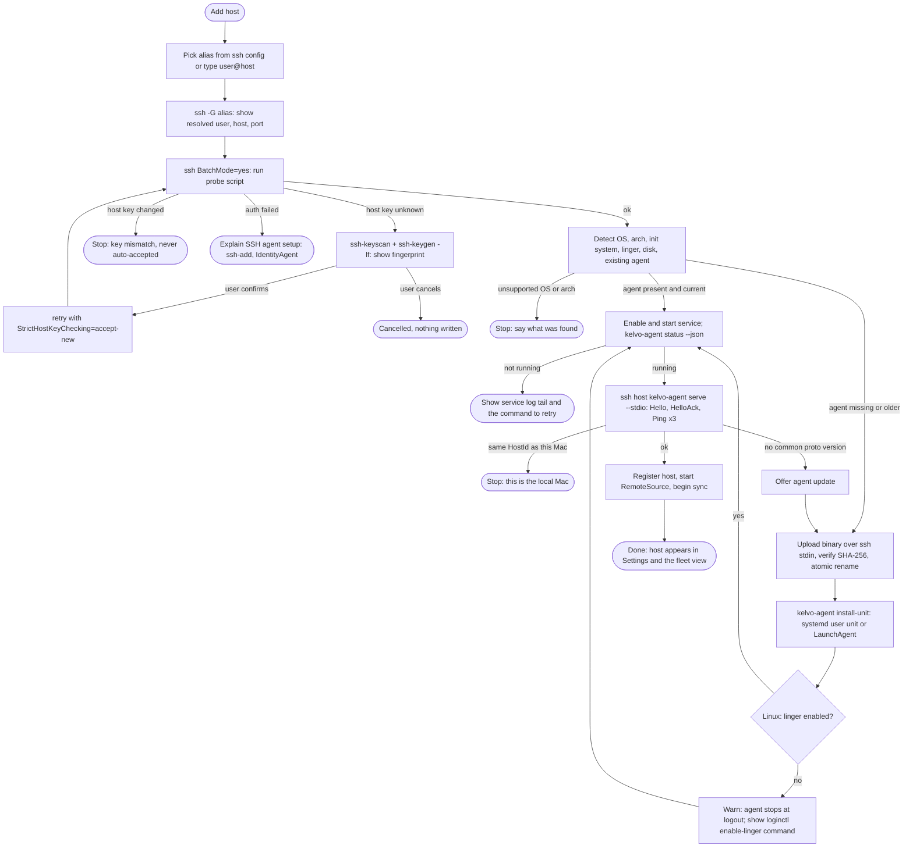
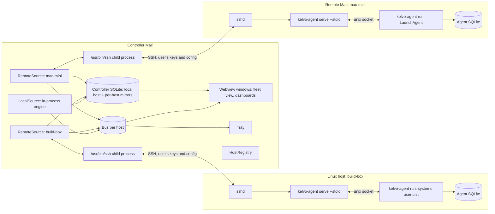
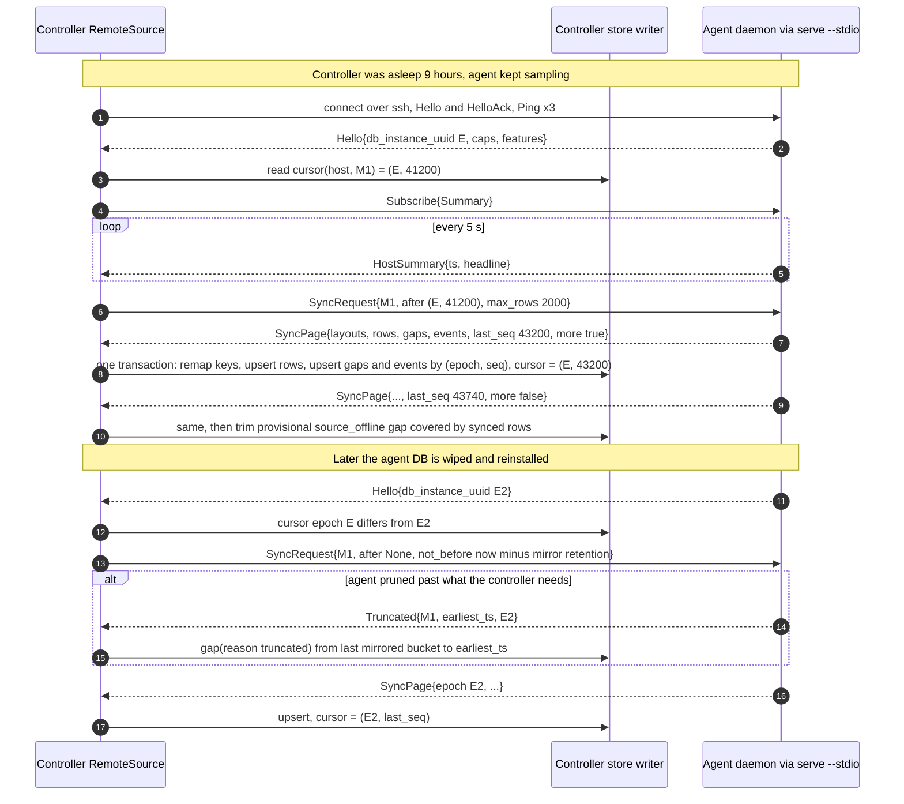

# v4: Remote hosts

This doc covers v4.0 through v4.2. v4.0 ships `kelvo-agent`, the SSH transport, the sync protocol in real use and the Add-host flow. v4.1 adds a native Linux collector set with cgroups and containers. v4.2 adds the fleet view, the host switcher, remote metrics in the menu bar, and alerts evaluated on the agent.

This is the version the v1 one-way doors were built for. Read [architecture.md](architecture.md) items 1 to 5 (series model, host identity, wire format, sync cursors, sources) and its Sync protocol section first; this doc refines them and does not repeat the type sketches. NVIDIA GPUs are out of scope (D-008).

## Goal and user value

People who use Kelvo on their Mac usually have a few other machines: a Linux box under the desk, a home server, a Mac mini doing CI, a couple of VPSes. Today they watch those with `htop` over SSH, which shows the present and forgets the past. v4 gives them the same thing Kelvo gives them locally: what is happening now, and what happened while they weren't looking, with attribution. "Why was the build box at 100% at 3am" gets the same answer as "why did my fans spin up at 3pm".

The agent keeps its own history, so a laptop that was closed all weekend comes back and backfills the weekend from every host. Nothing new runs on the network: the controller talks to agents over the user's existing SSH setup, with their keys, jump hosts and config.

## Problem and JTBD

| Job | When | What they need |
|---|---|---|
| Watch my servers | "Is anything on fire across my machines?" | A fleet view with one card per host, live state, a sparkline, and offline hosts shown honestly |
| Look back and attribute, remotely | "What hammered the build box overnight?" | Full Timeline and attribution on a remote host, including periods when the controller was asleep |
| Set up without ceremony | "I don't want to install Prometheus for four machines" | Pick a host from `~/.ssh/config`, click Add, done; no ports, no accounts, no root |
| Containers, not apps | "Which container is eating memory?" | On Linux, top consumers grouped by systemd unit and container rather than by process name |
| Glance at a remote | "Keep the NAS temperature in my menu bar" | A remote metric pinned to the menu bar |
| Be told | "Tell me if a host goes down or a disk fills, even if my laptop was asleep when it happened" | Rules evaluated on the agent, forwarded when connected, plus a host-offline alert |

## Scope

### Must

- v4.0: `kelvo-agent` for macOS (arm64) and Linux (x86_64, aarch64), with its own tiered history and a user-level service.
- v4.0: Add-host flow over `~/.ssh/config` with SSH agent auth; install and update the agent over SSH with no root.
- v4.0: transport `ssh host kelvo-agent serve --stdio`, speaking `kelvo-proto`: framing, handshake, capability negotiation, version skew handling.
- v4.0: ephemeral live stream; per-(host, tier) cursor sync of closed buckets with `(db_instance_uuid, seq)` epochs; `Truncated` handled as gap rows; idempotent upserts; clock-offset estimate.
- v4.0: bounded per-host mirror with a disk budget.
- v4.0: `HostSummary` frames in use, so the controller can hold many hosts cheaply.
- v4.1: Linux collectors for `/proc`, sysfs, hwmon, thermal zones, cgroups v2, and Docker, Podman and systemd units in place of the app list, with container series cardinality caps.
- v4.2: Hosts fleet view, host switcher that re-scopes every view, a remote metric pinned in the menu bar, agent-evaluated alerts forwarded to the controller, and a host-offline alert.
- Agent overhead under 0.3% CPU and 30 MB on the monitored host.

### Should

- v4.0: optional 10 s tier mirroring for the last 24 hours per host.
- v4.0: "Connect only while viewing" per host, for controllers on battery or metered links.
- v4.0: a series filter on sync so very wide hosts (64+ cores) can mirror cluster aggregates instead of every core.
- v4.1: per-process I/O on Linux from `/proc/<pid>/io` where readable.

### Won't

- NVIDIA or other discrete GPU metrics (D-008).
- Root-level installs, system-wide units or LaunchDaemons. Everything runs as the SSH user.
- Password or keyboard-interactive SSH auth. Kelvo runs `ssh` with `BatchMode=yes`; keys must be in an agent.
- A listening network port on the agent. The only way in is SSH.
- Windows hosts.
- Agent-to-agent or agent-to-cloud communication. The controller is the only consumer.
- Remote control actions (killing processes, restarting units).

## Experience

### Add-host flow (v4.0)

No mock. Compose from `11-first-run`: the centred window shell with the step counter ("1 of 3"), the bordered list with one row per item and a trailing control, and the footer with a status line on the left and Skip/Continue on the right. Component names from [design-system.md](design-system.md): `HostPicker`, `InstallProgress`.

Opened from "Add host" in Settings, Hosts (and in v4.2 from the fleet view). Three steps:

1. Pick a host. A list of `Host` aliases from `~/.ssh/config` (following `Include`, skipping wildcard patterns), each row showing the alias and the resolved `user@hostname:port` from `ssh -G`. A text field accepts `user@host` for hosts not in the config. Hosts already added are marked "Added".
2. Check and install. A checklist that fills in as each step runs: Connect, Detect system ("Linux 6.8 · x86_64 · systemd"), Install agent ("kelvo-agent 4.0.2"), Start service, Handshake. Each line shows its result in mono on the right, like the chip status line in the onboarding footer.
3. First sync. A progress line ("Copying history · 6 of 30 days") with a Done button that is enabled immediately; the sync continues in the background.

The flow, including every branch:



Error states always name the failing step, show the last lines of `ssh` stderr in a collapsible block, and offer Retry. Nothing is written to the controller's host list until the handshake succeeds; a cancelled install leaves the remote binary in place but no unit enabled.

### Hosts in Settings (v4.0)

No mock. Compose from `13-settings` Modules table (rows with a coloured dot, a name, a select and a trailing switch) and the Sampling group rows ("History on disk 148 MB" with Clear).

A Hosts section lists every host: status dot (Live, Connecting, Offline, Error), alias, OS, agent version, mirror size against its budget ("41 / 100 MB"), and an enabled switch. Row actions: Open dashboard, Update agent (shown when the bundled agent is newer), Mirror settings (budget, 10 s tier on/off, connect only while viewing), Remove. Remove asks whether to also uninstall the agent from the host (runs `kelvo-agent uninstall` over SSH) and whether to delete the mirrored history.

Error rows say what is wrong in words: "Host key changed", "SSH agent has no key for this host", "Agent not running (systemd user service failed)", "Agent 4.0.0 is too old for this version; update".

### Remote host dashboard (v4.0)

Reuses the whole Overview (machine header and module cards), with the v1 unsupported and gap states for modules the remote host lacks and for gap bands.

In v4.0, "Open dashboard" on a host opens a dashboard window scoped to that host (window label `dashboard-<hostId>`). Every existing route works because every query and store has been keyed by `hostId` since v1. The machine header shows the remote `HostInfo`. Modules the host doesn't have (GPU and Battery on most servers) show the "not available" state. Spans where the agent was not running, or where history was truncated, show the gap band with its reason ("Agent not running", "Older history pruned on host"). If the host's clock differs from the controller's by more than 2 seconds, the header shows "Clock differs by 41 s" in muted text.

The v4.2 host switcher replaces the per-host windows with one window that re-scopes.

### Linux host pages (v4.1)

No mock. Compose from `07-cpu-detail` (total chart, per-core heatmap, process table) and `08-power-and-sensors` (zone table) for module pages, and `04-overview-dark` cards for the Overview.

On Linux hosts the CPU page shows load average and pressure stall (PSI) next to the total chart, and the per-core heatmap with no P/E split. Power & Sensors becomes "Sensors": hwmon temperatures and fans in the zone table, labelled by hwmon chip and label (for example `k10temp · Tctl`), with no power rails unless RAPL is readable. Overview cards' top-5 lists group by systemd unit or container instead of process.

### Containers and units page (v4.1)

No mock. Compose from `07-cpu-detail` process table (sortable columns, mono figures) and `04-overview-dark` module card for the summary at the top.

A Linux-only sidebar entry, "Containers", appears when the host reports the `cgroup` capability. A table lists systemd services and containers: name, kind (service, Docker, Podman), CPU %, memory, memory limit, I/O rates, restart count where known. Rows beyond the cardinality cap are summarised in one "Other (17)" row. A container that has exited shows a gap from its exit onwards, not a drop to zero.

### Hosts fleet view (v4.2)

No mock. Compose from `04-overview-dark` module cards (title row with swatch and subtitle, ring, two inline bars, legend) and `15-component-sidebar` (the new "Hosts" entry and per-host rows with live values). Components: `HostCard`, `Sparkline`, `HostSwitcher` (design-system.md).

Route `/dashboard/hosts`. One card per host in a grid. Each card: host alias and OS in the title row, a status pill reusing the Overview's "Live" pill (green dot for live, muted for offline with "last seen 3 h ago", amber icon and text for errors), CPU and memory as inline bars, the hottest temperature if the host has one, network rates, and a 10-minute CPU sparkline. Live cards are fed by `HostSummary` frames, so the fleet view never needs full live streams. Offline cards draw the sparkline from the mirror's last hour with a gap where the host went away. Clicking a card switches to that host's Overview. An "Add host" card sits last.

Empty state: no hosts yet shows one card with "Add a Linux server or another Mac over SSH" and the Add host button.

### Host switcher (v4.2)

No mock. Compose from `15-component-sidebar` top region (above "Overview") and `13-settings` select controls.

A select at the top of the sidebar shows the current host with its status dot. Changing it re-scopes every route in the window: Overview, Timeline, module pages, Processes or Containers, and the sidebar's live values. The sidebar hides module entries the selected host lacks. Settings stays global, with the Hosts section for per-host options. `⌘` plus number shortcuts keep pointing at routes, not hosts.

### Remote metric in the menu bar (v4.2)

Uses the Values tray style (stacked 3-letter labels with a mono value: "CPU 18%", "SOC 61°").

Settings, Menu bar, "Add remote metric" picks a host and one of its `HostSummary` headline metrics. The tray gains a values-style item whose stacked label is the first three letters of the host alias over the metric's short label ("NAS" over "TMP", value "47°"). It updates from summary frames (every 5 seconds), so it costs no extra stream. Offline shows "–" in muted ink with the accessibility label "NAS temperature, host offline". These items follow v1.1's per-module tray items, including ⌘-drag ordering.

### Remote alerts (v4.2)

No mock. Compose from the v2.3 Alerts editor (`13-settings` rows plus `09-widget-composer` inspector rows).

The rule editor gains a Scope field: This Mac, a specific host, or All remote hosts. Remote-scoped rules are pushed to agents and evaluated there, so they fire even while the controller is asleep. When the controller reconnects, alerts that fired more than 15 minutes ago are collapsed into one notification ("build-box: 3 alerts while disconnected") with a link to the Timeline, rather than replayed one by one. Fired alerts appear as annotations on the remote Timeline like local ones.

A built-in "Host offline" rule per host is on by default: notify when a host has been unreachable for 5 minutes while this Mac is awake and online, and again when it recovers. Authentication or host-key errors notify once as configuration problems, not as outages.

## Architecture changes

### Deployment



### Crates

| Crate | New or changed | Contents |
|---|---|---|
| `kelvo-agent` | New binary | `run` (daemon: engine, store writer, socket server), `serve --stdio` (proxy between stdio and the daemon's socket), `install-unit`, `uninstall`, `status --json`, `version --json` |
| `kelvo-remote` | New library, controller side | SSH process management, the probe and install scripts, `RemoteSource`, sync client, ingest remapping, mirror budget. Depends on proto, store and engine; never on Tauri, so its integration tests run on the Linux CI runner |
| `kelvo-proto` | Changed | `LiveTier::Summary`, `SyncRequest.not_before_ts_ms`, alert messages (v4.2), all as negotiated additions |
| `kelvo-collect` | Changed | `linux/` collectors (v4.1); headless `PowerSignals` for the macOS agent |
| `kelvo-store` | Changed | Remote-origin keys on gaps and events, per-host usage accounting, provisional gaps |
| `src-tauri` | Changed | Hosts commands, Add-host flow driver, per-host windows (v4.0) then the switcher (v4.2) |

The agent daemon is the single writer of its database. `serve --stdio` holds no state: it connects to the daemon's socket and copies bytes both ways, so every protocol path is implemented once, in the daemon. If the daemon isn't running, `serve` answers the handshake itself with `Error { code: AgentNotRunning }` so the controller can say exactly that.

| Platform | Binary | Data | Socket | Service |
|---|---|---|---|---|
| Linux | `~/.local/bin/kelvo-agent` | `${XDG_STATE_HOME:-~/.local/state}/kelvo-agent/` | `${XDG_RUNTIME_DIR}/kelvo-agent.sock`, else the data dir | `~/.config/systemd/user/kelvo-agent.service`, `systemctl --user enable --now` |
| macOS | `~/.local/bin/kelvo-agent` | `~/Library/Application Support/kelvo-agent/` | data dir | `~/Library/LaunchAgents/com.tryopendata.kelvo.agent.plist`, `launchctl bootstrap gui/<uid>` |

The controller always invokes the agent by absolute path (`~/.local/bin/kelvo-agent`), because a non-interactive SSH session's `PATH` often lacks `~/.local/bin`.

On macOS the agent is a headless process with no AppKit run loop, so its `PowerSignals` uses `IORegisterForSystemPower` for sleep and wake; display sleep and lock don't matter for an agent. A LaunchAgent in the `gui` domain only runs while that user is logged in. Bootstrapping it from an SSH session when nobody is logged in at the console may fail (unverified); the flow detects this and says the Mac needs a logged-in session or auto-login. A LaunchDaemon is a Won't.

On Linux, a systemd user service stops at logout unless lingering is enabled, and enabling it usually needs root or polkit. The flow checks `loginctl show-user $USER -p Linger`, warns if it is off, and shows the one command an admin would run. Hosts without systemd (Alpine with OpenRC, containers) get a documented fallback: `kelvo-agent run --daemonize` started from the user's crontab `@reboot` (Should).

### Agent binaries and install

The controller bundles agent binaries in its app resources: `kelvo-agent-x86_64-unknown-linux-musl`, `kelvo-agent-aarch64-unknown-linux-musl` (static, built with `cargo zigbuild` on the Linux runner), and `kelvo-agent-aarch64-apple-darwin` (signed and notarized by the v3.0 release workflow). Bundling keeps installs offline-capable and version-locked to the controller, at roughly 15 MB of app size (estimate). Each binary's SHA-256 is compiled into the controller.

Install and update run POSIX `sh` scripts piped over `ssh host sh -s`, so there is nothing to scp and no dependence on the remote shell being bash:

| Step | Command shape | Checks |
|---|---|---|
| Probe | `uname -s -m`, `command -v systemctl`, `systemctl --user is-system-running`, `loginctl show-user`, `df -Pk` on the data dir, `~/.local/bin/kelvo-agent version --json` | Supported OS and arch; enough disk for the agent's budget |
| Upload | Binary streamed on stdin into `~/.local/bin/.kelvo-agent.tmp` | `sha256sum` or `shasum -a 256` matches; then `chmod +x` and `mv` over the old binary |
| Unit | `kelvo-agent install-unit` writes the unit or plist | Idempotent; rewrites only if the content changed |
| Start | `systemctl --user enable --now kelvo-agent` or `launchctl bootstrap` / `kickstart -k` | `kelvo-agent status --json` reports running within 5 s |

An update replaces the binary and restarts the service. The agent writes an `app_not_running` gap for its own restart, which is a few seconds. Updates are offered, not forced: version skew handling means an older agent keeps working until the protocol says otherwise.

### SSH transport

`RemoteSource` runs the system `/usr/bin/ssh` as a child process rather than an embedded SSH library. That way it honours everything the user already has: `~/.ssh/config`, `ProxyJump`, `ControlMaster`, `IdentityAgent` (1Password, Secretive), known hosts and certificates. An embedded library would reimplement a subset and get the rest wrong.

```
ssh -T -o BatchMode=yes -o ConnectTimeout=10 -o ServerAliveInterval=15 \
    -o ServerAliveCountMax=3 -o RemoteCommand=none <alias> -- ~/.local/bin/kelvo-agent serve --stdio
```

`BatchMode=yes` means ssh never prompts; any prompt becomes a failure the UI explains. Stderr is captured into a per-host ring of the last 50 lines for error display. Reconnects use exponential backoff from 1 s to 60 s with jitter, reset on a successful handshake. On the controller's `WillSleep` all SSH children are closed; on `DidWake` they reconnect, staggered.

Each enabled host holds one SSH connection. A host is in one of two subscription modes: summary (the default: `HostSummary` every 5 s plus periodic sync) or live (`Live1s`, used while a window is showing that host). Rust switches modes with `Subscribe`/`Unsubscribe` on the same connection, following the v1 rule that Rust, not the webview, decides when streams stop.

### Protocol use: handshake, capabilities, skew

The handshake is as in architecture item 3: the agent sends `Hello { proto_version, min_compatible, app_version, host, db_instance_uuid, capabilities, features }`, the controller answers `HelloAck` with the version it chose and the features both sides support, then three `Ping`/`Pong` rounds.

| Situation | Outcome |
|---|---|
| Ranges `[min_compatible, proto_version]` overlap | Both use the highest common version |
| No overlap, agent older | Controller shows "Update agent" and offers the update flow |
| No overlap, agent newer | Controller shows "Update Kelvo on this Mac"; the agent is left alone |
| A feature in one side's set only | That behaviour is off for this connection (for example `alerts` with a v4.0 agent) |
| Unknown message type | Logged once per type and skipped (`Message::Unknown`) |
| Unknown `metric_id` in a layout | Series ignored by the controller's UI but still stored, so a later controller version can show it |
| Agent `HostId` equals the local host's | Refused: "This is this Mac" |

New messages and fields in v4, all optional so a v4.0 peer and a v4.2 peer interoperate:

| Addition | Version | Direction | Purpose |
|---|---|---|---|
| `LiveTier::Summary` | 4.0 | C to A in `Subscribe` | Ask for `HostSummary` every 5 s instead of `Live` frames |
| `SyncRequest.not_before_ts_ms` | 4.0 | C to A | Floor for full resyncs so the agent doesn't send rows the mirror would prune |
| `SyncRequest.series` (Should) | 4.0 | C to A | Mirror only matching series on very wide hosts |
| `AlertRules { revision, rules }` | 4.2 | C to A | Replace the agent's remote-scoped rule set |
| `AlertFired { epoch, seq, event }` | 4.2 | A to C | Immediate notice of an alert event; `(epoch, seq)` matches the event row that sync delivers later |

The `HostSummary` headline set is fixed per OS so cards and tray items know what to expect, and is still a list of `(SeriesKey, f32)` so it can grow:

| Headline | macOS agent | Linux agent |
|---|---|---|
| CPU total | `cpu.load` | `cpu.load` |
| Memory used % and pressure | yes | used %, PSI memory `some avg10` |
| Hottest temperature | hottest SoC zone | hottest hwmon or thermal zone, if any |
| Network rx/tx | sum of interfaces | sum of non-virtual interfaces |
| Disk busy or I/O | read+write rate | read+write rate |
| Load average 1 min | no | yes |
| Active alerts | count (4.2) | count (4.2) |

The CI skew test from v1 gains an agent matrix: the current controller code against the previous release's agent binary, and the current agent against the previous release's controller sync client, both over a pipe on the Linux runner.

### Sync

Sync follows architecture item 4. This section covers what v4 adds on top: the controller's ingest path, epochs in practice, provisional offline gaps, and the mirror budget.



Ingest rules, applied in one write transaction per page on the controller's single writer:

1. Every `WireLayout` in the page is resolved to a controller `LayoutId`: series keys are interned into the controller's `series` table under the remote host, the ordered id list is hashed, and an existing layout with that hash is reused. Remote intern ids never cross the wire.
2. Bucket rows upsert on `(host_id, bucket_ts, layout_id)` in the matching tier table, exactly as architecture item 4 specifies.
3. Gaps and events from the agent upsert on a new remote-origin key, `(host_id, src_epoch, src_seq)`, because their local primary keys mean nothing on the controller. Replaying a page therefore produces no duplicates.
4. Process names in `proc_top_1m` blobs travel as strings and are interned on the controller.
5. The cursor `(epoch, last_seq)` for `(host, tier)` is written in the same transaction, so a crash between pages loses nothing and repeats nothing visible.

Controller rows get controller-local `seq` values like any other row. Rollups are stored as received and never recomputed.

Provisional offline gaps refine the architecture's sync sequence, which writes a `source_offline` gap when a connection drops. If that gap stayed, it would cover hours the agent actually recorded and later synced. In v4.0 a `source_offline` gap is written with `provisional = 1`. After a sync catches up, the writer deletes or trims provisional gaps to the parts that no synced bucket covers. A host that never comes back keeps its provisional gap, which is the honest answer. Architecture.md's sync protocol section describes the same rule.

The sync loop runs once per persisted tier after each handshake, then every 60 s for M1 (just after the minute bucket closes) and, if the 10 s tier is mirrored, every 30 s. On battery, every 5 minutes. Pages stop at 2,000 rows or 3 MB of encoded rows, whichever comes first: 2,000 rows at 150 series is already about 3.6 MB, and wider hosts would otherwise exceed the frame size limit (proposed: 4 MiB, enforced by `kelvo-proto` on decode).

Clock offset comes from the minimum-RTT `Ping`/`Pong` sample: `offset = t_remote - (t0 + rtt / 2)`. It is re-estimated every 10 minutes and stored on the host record. It is used only when overlaying two hosts on one chart and for the "Clock differs" note, never to rewrite timestamps.

### Mirror and disk budget

| Setting | Default | Notes |
|---|---|---|
| Mirrored tiers | M1 for 30 days | S10 for 24 hours is opt-in per host (Should) |
| Per-host disk budget | 100 MB | Editable per host; shown as used/budget in Settings |
| Enforcement | After each sync | If over budget, prune the host's oldest M1 rows in batches until under; the effective history span is shown ("History kept: 19 days") |
| Accounting | `host_usage(host_id, bytes)` updated incrementally from blob lengths at ingest and prune | Avoids scanning; reconciled weekly against `SUM(length(blob))` |

At about 150 series a host fits 30 days well inside 100 MB (architecture's budget math gives ~89 MB for M1 at 150 series, before process tables). A 64-core Linux host with containers can produce 400 series, which would need ~240 MB for 30 days; the budget then trims to about 12 days unless the user raises it or turns on the per-core series filter.

The local host's 150 MB budget is unchanged and separate.

### Linux collectors (v4.1)

All `cfg(target_os = "linux")` in `kelvo-collect/linux/`, reporting through the same `Collector` trait and `Probe`. The engine's `Ticker` on Linux is a `timerfd`; `PowerSignals` listens for logind's `PrepareForSleep` over D-Bus (`zbus`), and is a no-op where logind is absent.

| Module | Source | Cadence (1 s base) | Series examples |
|---|---|---|---|
| CPU load, per core | `/proc/stat` jiffies deltas | every tick | `cpu.load`, `cpu.load{core=17}` |
| CPU frequency | `/sys/devices/system/cpu/cpu*/cpufreq/scaling_cur_freq` | every 5 ticks | `cpu.freq{core=17}` |
| Load average | `/proc/loadavg` | every 5 ticks | `cpu.loadavg{window=1m}` |
| Pressure stall | `/proc/pressure/{cpu,memory,io}` | every 5 ticks | `psi.some{res=memory,window=10s}` |
| Memory | `/proc/meminfo` | every tick | `mem.used`, `mem.cached`, `mem.swap_used` |
| Disk I/O | `/proc/diskstats` deltas, whole disks only | every tick | `disk.read{dev=nvme0n1}` |
| Filesystems | `statvfs` over `/proc/self/mountinfo`, real filesystems only | every 60 ticks | `fs.used{mount=/srv}` |
| Network | `/sys/class/net/*/statistics`, excluding `lo`, veth and bridges by default | every tick | `net.rx{if=eth0}` |
| Temperatures | `/sys/class/hwmon/hwmon*/temp*_input` with `name` and `temp*_label`; `/sys/class/thermal/thermal_zone*/temp` with `type` | every 5 ticks | `thermal.zone{chip=k10temp,label=Tctl}` |
| Fans | hwmon `fan*_input` | every 5 ticks | `fan.rpm{chip=nct6798,fan=2}` |
| Power | RAPL `/sys/class/powercap/intel-rapl:*/energy_uj` deltas | every tick | `power.package{zone=0}`; usually root-only since kernel 5.10, so typically `Unsupported` (unverified per distro) |
| Battery | `/sys/class/power_supply/*` | every 10 ticks | as macOS |
| Processes | `/proc/<pid>/stat`, `status`, `io` where readable | every 10 ticks, every tick while viewed | process snapshots |
| cgroups v2 | `/sys/fs/cgroup/**/cpu.stat`, `memory.current`, `memory.max`, `io.stat`, `memory.pressure` | every 5 ticks | `cgroup.cpu{unit=nginx.service}`, `cgroup.mem{ctr=postgres}` |

Units and containers are found by walking the cgroup v2 hierarchy, not by asking a daemon:

| Kind | cgroup path pattern | Name source |
|---|---|---|
| systemd service | `system.slice/<name>.service`, and `user.slice/.../<name>.service` | The path itself |
| Docker | `system.slice/docker-<id>.scope` | Docker Engine API `GET /containers/json` over `/var/run/docker.sock` if the user can read it (docker group); otherwise the short id |
| Podman, rootless | `user.slice/user-<uid>.slice/user@<uid>.service/.../libpod-<id>.scope` | Podman API socket under `$XDG_RUNTIME_DIR/podman/` if present; otherwise the short id |

cgroups v1 hosts report the `cgroup` capability as `Unsupported` with a reason; the rest of the collectors work.

Cardinality caps keep container churn from blowing up the store. `MetricDef.max_cardinality` (architecture item 1) is 32 for `cgroup.*` series by default. Every 5 ticks the collector ranks units and containers by a CPU-plus-memory score, keeps the top 32 as their own series, and folds the rest into `{unit=_other}`. Membership changes would mint a new layout every time a container starts, so the collector only changes its emitted set on M1 bucket boundaries (at most one new layout per minute) and keeps a departing member for one extra minute so short restarts don't churn. The store's layout dedupe by hash means a container that comes back produces the same layout again.

On Linux hosts, the "app list" (Overview top-5 lists, Timeline attribution, the sustained-process detector) groups by unit or container when the process belongs to one, and by process name otherwise. The grouping key is a label on process snapshots, so macOS behaviour is unchanged.

### Fleet, switcher, menu bar and alerts (v4.2)

The frontend already has one zustand store per host and `hostId` in every query key. v4.2 adds a `currentHostId` to the dashboard window's router state, and every route reads it. The fleet view subscribes each visible card's host in summary mode; the host shown in a dashboard is in live mode. A `HostSummary` ring of 10 minutes per host is kept in Rust and backfilled to the fleet view when it opens, like the 1 s ring for live data.

Remote tray items reuse the v1.1 per-module tray item pipeline (render, quantize, hash) and read from the summary ring.

Remote alerts reuse the engine's evaluator on the agent. The controller owns rule definitions (single writer) and sends `AlertRules` to each agent whose scope matches, after every rule change and on every handshake (the agent compares `revision`). The agent stores them in its own settings file and evaluates them in its engine. A fired rule becomes an event row (kind `alert`, with `seq`) on the agent, and, when connected, an `AlertFired` frame. The controller notifies on `AlertFired` and records `(epoch, seq)` as delivered, so when the same event later arrives through sync it is stored but not notified again. Agents without the `alerts` feature show "Update agent to evaluate alerts on this host" in the editor.

The host-offline alert runs on the controller. It counts a host as unreachable after consecutive connection failures for 5 minutes (configurable), only while the controller is awake and at least one network path is up (`NWPathMonitor` status satisfied). Timeouts and refused connections count; authentication and host-key failures produce a single "configuration problem" notification instead.

## Data and schema changes

| Change | Where | Version | Migration |
|---|---|---|---|
| Remote hosts in `hosts` with `is_local = 0` | Controller store | 4.0 | None; table exists since v1 |
| Host connection settings (alias, mode, budget, mirrored tiers, last error, clock offset) | Settings store, keyed by `HostId` | 4.0 | None |
| `sync_cursors(host_id, tier, epoch, seq, updated_ms)` | Controller store | 4.0 | New table (cursor columns were defined in v1; this is the controller's table for remote epochs) |
| `src_epoch`, `src_seq` on `gaps` and `events`, unique `(host_id, src_epoch, src_seq)` where not null | Controller store | 4.0 | `ALTER TABLE ADD COLUMN` (nullable); local rows leave them null |
| `provisional` on `gaps` | Controller store | 4.0 | Nullable column, default 0 |
| `host_usage(host_id, bytes)` | Controller store | 4.0 | New table, computed once on migration |
| Grouping label on process snapshots (`unit` or `ctr`) | Store blob format version bump | 4.1 | Readers accept both versions |
| `RuleScope::Host(HostId)`, `RuleScope::AllRemote` | `kelvo-schema` alert rules | 4.2 | Existing rules stay `Local` |
| `delivered_alerts(host_id, epoch, seq)` | Controller store | 4.2 | New table, pruned with events |
| Agent database | Same schema as the local store via `kelvo-store` | 4.0 | Created by `kelvo-agent run` |

## Performance budget deltas

| Scenario | Target | Method |
|---|---|---|
| Agent on the monitored host, steady state, summary mode | < 0.3% of one core, < 30 MB RSS | Linux: `/proc/<pid>/stat` utime+stime delta over 10 min and `VmRSS` from `/proc/<pid>/status`; macOS: `proc_pid_rusage` and `footprint`. Measured on a 4-core VM and a 32-core host |
| Agent in live mode (controller viewing) | < 0.5% of one core | Same |
| Agent with 200 containers (v4.1) | < 0.3% steady state after the cap; collector pass < 5 ms | Synthetic cgroup tree in a test VM |
| `serve --stdio` proxy | < 2 MB RSS, negligible CPU | Same |
| Controller per host, summary mode | < 0.02% CPU, < 2 MB | `scripts/bench-vs-stats.sh` with 10 hosts connected |
| Controller ssh child processes | ~5 MB RSS each (estimate) | `footprint` |
| Bandwidth per host, summary mode | < 0.5 KB/s average including sync | Byte counters in `RemoteSource` |
| Initial 30-day sync of a 150-series host | < 2 minutes on a LAN | Timed in the soak test |
| Controller local idle budget | Unchanged when no dashboard shows a remote host | v1 method |

## Milestones

### v4.0: Agent, transport, sync, Add host

#### Phase 4.0a: Agent skeleton and protocol

Agent:
- [ ] `crates/kelvo-agent` with `run`, `serve --stdio`, `status --json`, `version --json`
- [ ] Daemon owns the engine and store; unix socket server; `serve` is a byte proxy; `AgentNotRunning` error from `serve`
- [ ] Headless `PowerSignals` on macOS via `IORegisterForSystemPower`
- [ ] Linux build via `cargo zigbuild` for x86_64 and aarch64 musl, using the v1 sysinfo-backed baseline collectors until v4.1

Proto:
- [ ] Handshake, version selection and feature intersection per the skew table
- [ ] `LiveTier::Summary`, `HostSummary` emission every 5 s, `SyncRequest.not_before_ts_ms`
- [ ] Agent matrix skew test on the Linux runner (current vs previous release, both directions)
- [ ] Fuzz targets (`cargo fuzz`) for frame decoding, `Message` decode and sync-page ingest: a compromised or buggy agent must not be able to crash or wedge the controller. Run in CI for a bounded time per PR and longer nightly
- [ ] Handshake rejects a peer whose host id equals the controller's local host id (D-071), and ingest caps series, layouts and label cardinality per host

Acceptance: on the Linux CI runner, a test harness pipes a controller-side client into `kelvo-agent serve --stdio`, completes the handshake, receives `Live` and `HostSummary` frames, and an older-version fixture agent negotiates down without errors.

#### Phase 4.0b: Sync and mirror

Store and remote:
- [ ] `crates/kelvo-remote` with the sync client and ingest remapping
- [ ] `sync_cursors`, `src_epoch`/`src_seq` columns and unique index, `provisional` gaps, `host_usage`
- [ ] Ingest transaction per page with cursor advance; page caps by rows and bytes
- [ ] Epoch mismatch full resync with `not_before_ts_ms`; `Truncated` writes a `truncated` gap
- [ ] Provisional `source_offline` gap trimming after catch-up
- [ ] Mirror budget enforcement and the effective history span

Tests (two real stores in one process, agent side driven by a fake ticker):
- [ ] Replaying every page twice yields identical controller rows
- [ ] Killing the connection mid-page and resuming yields no gaps and no duplicates
- [ ] Agent prunes past the cursor: controller shows a `truncated` gap, nothing interpolated
- [ ] Agent DB wiped: new epoch triggers resync, old mirrored history kept
- [ ] Controller asleep 9 h while agent samples: after sync, no `source_offline` gap remains for the covered span
- [ ] Budget: a 400-series host trims to the budget and reports the span

Acceptance: all tests above pass in CI on Linux and macOS.

#### Phase 4.0c: SSH transport and RemoteSource

- [ ] `RemoteSource` implementing the v1 `Source` trait, spawning `/usr/bin/ssh` with the documented options
- [ ] stderr ring per host; error classification (host key unknown, host key changed, auth, timeout, agent missing, agent not running, proto mismatch)
- [ ] Backoff with jitter; close on `WillSleep`, staggered reconnect on `DidWake`
- [ ] Summary and live modes switched by Rust from window visibility
- [ ] Clock offset estimate and the "Clock differs" note
- [ ] CI job: sshd on the Linux runner's localhost with a key in `ssh-agent`, `RemoteSource` connects through real ssh

Acceptance: the CI job connects, streams for 60 s, drops the connection by killing sshd's child, reconnects within the backoff window and resumes sync from the cursor.

#### Phase 4.0d: Install, update and the Add-host UI

Remote:
- [ ] `~/.ssh/config` reader with `Include` support, wildcard skipping, `ssh -G` resolution
- [ ] Probe, upload, unit and start scripts in POSIX `sh`, tested with `dash` and `busybox sh`
- [ ] `install-unit` and `uninstall` for systemd user units and LaunchAgents
- [ ] Linger detection and warning; non-systemd fallback documented
- [ ] Agent binaries bundled in app resources with compiled-in SHA-256 values; release workflow builds and signs them

App:
- [ ] Add-host window (three steps, `HostPicker`, `InstallProgress`) with every branch of the flow diagram
- [ ] Settings, Hosts section: status, agent version, mirror usage, enable switch, Update agent, Mirror settings, Remove (with optional uninstall and history delete)
- [ ] `dashboard-<hostId>` windows for remote hosts

Acceptance: from a clean Ubuntu VM and a clean macOS VM reachable by alias in `~/.ssh/config`, Add host completes without a terminal, the dashboard shows live data within 10 s of Done, and Remove with uninstall leaves no unit and no binary on the host.

#### Phase 4.0e: Soak and budget

- [ ] 72-hour soak: three hosts, controller sleeping on a schedule, one agent restarted hourly, one host's network dropped for an hour
- [ ] Agent budget measured on a 4-core VM and a 32-core host; results in PROGRESS.md
- [ ] Controller budget with 10 hosts in summary mode

Acceptance: after the soak, the controller's mirrors match each agent's own M1 rows bucket for bucket for the retained span, and every budget row in the table is met.

### v4.1: Linux collectors

#### Phase 4.1a: Host collectors

- [ ] `/proc/stat`, `cpufreq`, `loadavg`, PSI, `meminfo`, `diskstats`, mountinfo plus `statvfs`, net statistics collectors
- [ ] hwmon and thermal zone collectors with chip and label naming; fans
- [ ] RAPL collector with a clean `Unsupported` when not readable
- [ ] Process collector from `/proc/<pid>/*`, tolerant of vanished pids and unreadable files
- [ ] Fixture tests built from captured `/proc` and `/sys` trees from three distros (Ubuntu, Debian, Fedora) and an ARM board

Acceptance: on each test host the values agree with `mpstat`, `free`, `iostat` and `sensors` within ±5% (±2 °C for temperatures).

#### Phase 4.1b: cgroups and containers

- [ ] cgroup v2 walker and per-cgroup series
- [ ] systemd unit, Docker and rootless Podman discovery and naming, with id fallback
- [ ] Cardinality cap of 32 with `_other`, membership changes only at M1 boundaries, one-minute hold
- [ ] Unit and container grouping label on process snapshots; attribution and top-5 lists use it on Linux
- [ ] Containers page and Linux variants of the CPU and Sensors pages
- [ ] Churn test: start and stop 200 short-lived containers over an hour; layouts minted ≤ 60, agent within budget

Acceptance: the Containers page on a Docker host lists running containers by name, an exited container shows a gap, and the churn test passes.

### v4.2: Fleet view, switcher, menu bar, alerts

#### Phase 4.2a: Fleet view and host switcher

- [ ] `/dashboard/hosts` with `HostCard`, `Sparkline`, status pills, Add host card and empty state
- [ ] Rust-side 10-minute `HostSummary` ring and backfill
- [ ] `HostSwitcher` in the sidebar; `currentHostId` in router state; all routes re-scope; sidebar hides absent modules
- [ ] `dashboard-<hostId>` windows retired in favour of the switcher

Acceptance: with five hosts (two offline), the fleet view renders all cards within 300 ms of opening, offline cards show their last hour with a gap, and switching hosts updates every route without a reload.

#### Phase 4.2b: Remote metric in the menu bar

- [ ] "Add remote metric" in Settings, choosing from the host's headline set
- [ ] Values-style tray item with the host label, fed from the summary ring, offline state and accessibility label

Acceptance: a pinned remote temperature updates every 5 s and shows "–" within 30 s of the host going offline.

#### Phase 4.2c: Remote alerts and host offline

- [ ] `RuleScope::Host` and `RuleScope::AllRemote`; Scope field in the editor
- [ ] `AlertRules` push on change and on handshake; agent persists and evaluates them
- [ ] `AlertFired` handling, `delivered_alerts` dedupe, collapsed notification for alerts older than 15 minutes
- [ ] Host-offline rule on the controller with network-path gating and config-error handling
- [ ] Test: rule fires on the agent while the controller is disconnected; on reconnect exactly one summary notification is shown and the Timeline annotation appears

Acceptance: the test above passes, and stopping an agent's host produces one offline notification after 5 minutes and one recovery notification.

## Success criteria

- Adding a Linux host takes under two minutes from opening the flow, with no terminal, for a host already in `~/.ssh/config`.
- After any combination of controller sleep, agent restarts, network drops and agent DB wipes, the controller's mirror matches the agent's data for the retained span, and every missing span is a labelled gap.
- The agent meets 0.3% CPU and 30 MB on the reference hosts.
- The fleet view shows ten hosts with the controller's own idle budget unchanged when no dashboard is showing a remote host.
- An alert that fires on a host while the controller is asleep is visible on the controller after wake, once.

## Risks and open questions

| Risk or question | Impact | Plan |
|---|---|---|
| systemd user services stop at logout without linger, and enabling linger needs root on many hosts | Agent stops when the user's last session ends; history has gaps | Detect and warn with the exact command; the gap is recorded as `app_not_running`; crontab fallback for non-systemd hosts |
| LaunchAgent bootstrap from SSH on a Mac with nobody logged in (unverified) | Remote Mac agent can't start headless | Detect and explain; LaunchDaemon stays a Won't |
| RAPL readable only by root on kernels since 5.10 (unverified per distro) | No power data on most Linux hosts | Report `Unsupported` with the reason; never show zeros |
| Docker socket access requires the docker group | Containers named by short id | Id fallback; the Containers page explains why names are missing |
| Bundled agent binaries add app size (~15 MB, estimate) | Bigger download for people who never use remote hosts | Accept for v4.0; revisit downloading on demand from the GitHub release if size complaints appear |
| Per-host sync page size against the frame size limit | Oversized frames fail | Agent caps pages by bytes as well as rows |
| Wide hosts exceed the mirror budget quickly | Short remote history by default | Show the effective span; the per-core series filter (Should) |
| Users with `RemoteCommand` or `RequestTTY` in their ssh config for an alias | `serve --stdio` gets mangled | Pass `-T` and `-o RemoteCommand=none`; test with such a config |
| Host keys rotated legitimately | Connection refused | Clear "Host key changed" error with instructions; never auto-accept a changed key |
| The sandboxed App Store edition cannot run `/usr/bin/ssh` with user config | Remote hosts impossible in a store edition | v4 is direct-edition only; noted against D-015's outcome |

## Infra this version lays for later versions

- `kelvo-remote` and `RemoteSource` are transport-agnostic above the byte stream, so a later transport (a unix socket for a local helper, or a direct TLS connection) is a new spawner, not a new protocol.
- The agent is the same engine as the app; if D-014 moves the local engine into a helper, it is this binary in local mode.
- Remote-origin keys and provisional gaps make the store safe for any future producer that replays data.
- `RuleScope` and agent-evaluated rules let later versions push other engine configuration (sampling cadence, collector toggles) to agents the same way.
- The Linux collector set, with cgroups and cardinality caps, is what any later container-heavy feature builds on.

## Depends on

| Interface | Defined in | Used by |
|---|---|---|
| Series model, `SeriesKey`, catalog with `max_cardinality` | v1.0 (architecture item 1) | Wire layouts, ingest remapping, container caps |
| `HostId`, `HostRecord`, `HostInfo`, `is_local` | v1.0 (item 2) | Host registration, self-detection |
| `kelvo-proto` framing, CBOR, `Message` enum including reserved `HostSummary`, skew fixtures | v1.0 (item 3) | Transport and all messages |
| `seq` on every row, `db_instance_uuid`, `Cursor`, `SyncRequest`, `SyncPage`, `Truncated` | v1.0 (item 4) | Sync |
| `Source` trait, `SourceSink`, `HostRegistry`, bus per host | v1.0 (item 5) | `RemoteSource` |
| `Ticker` and `PowerSignals` traits, `cfg(target_os)` collectors, Linux cross-check CI | v1.0 (item 6) | Linux agent, headless macOS agent |
| Engine alert evaluation and serializable rules | v1.2 (item 7) | Agent-side alerts |
| Single writer per DB and Rust-owned settings | v1.0 (item 8) | Agent daemon, controller ingest, rule ownership |
| Dynamic capabilities and the "not available" state | v1.0 (item 9) | Linux hosts without GPU or battery |
| `hostId`-keyed zustand stores and TanStack Query keys | v1.0 | Remote dashboards, switcher |
| Per-module tray items and ⌘-drag ordering | v1.1 | Remote metric in the menu bar |
| Event rows and Timeline annotations | v1.2 | Remote alert annotations |
| Alerts editor and `RuleScope` | v2.3 | Remote alert scopes |
| `WidgetInstance.host` | v2.0 | Reserved; remote widgets are not in v4 scope |
| Release workflow with Developer ID signing and notarization | v3.0 | Signing the macOS agent binary |
